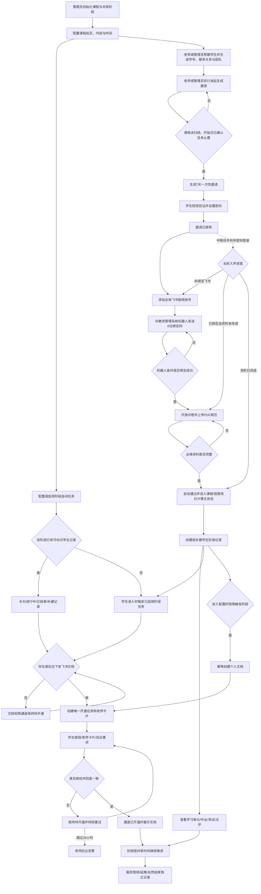
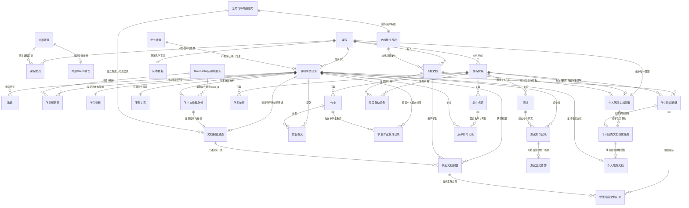
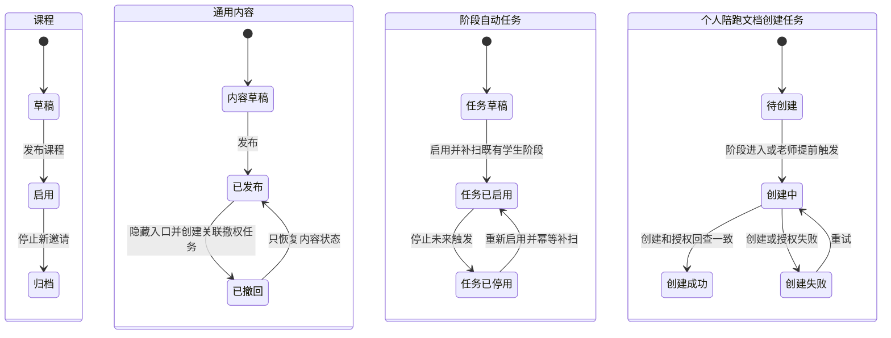
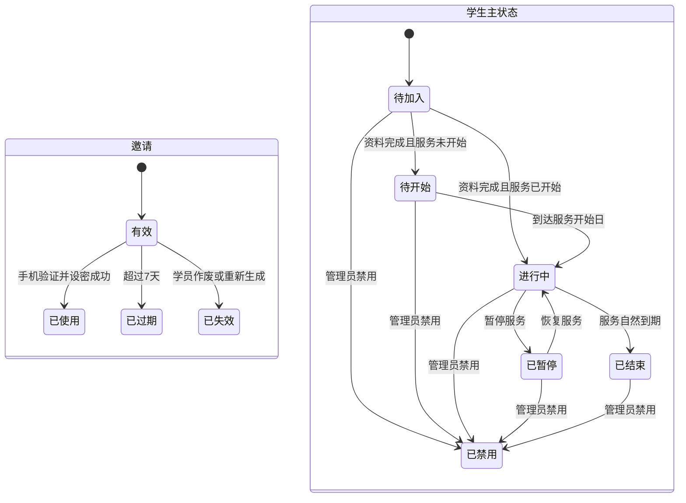
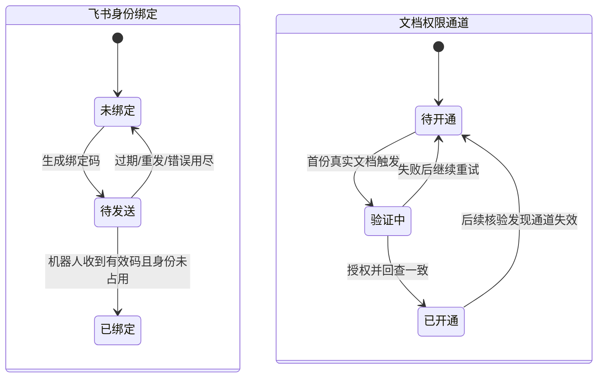
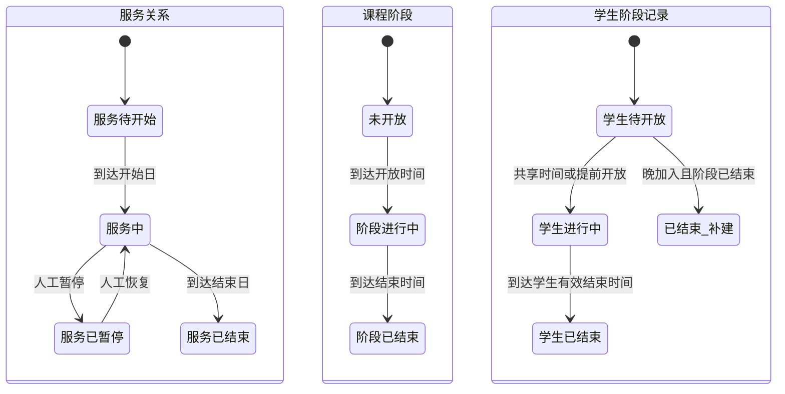
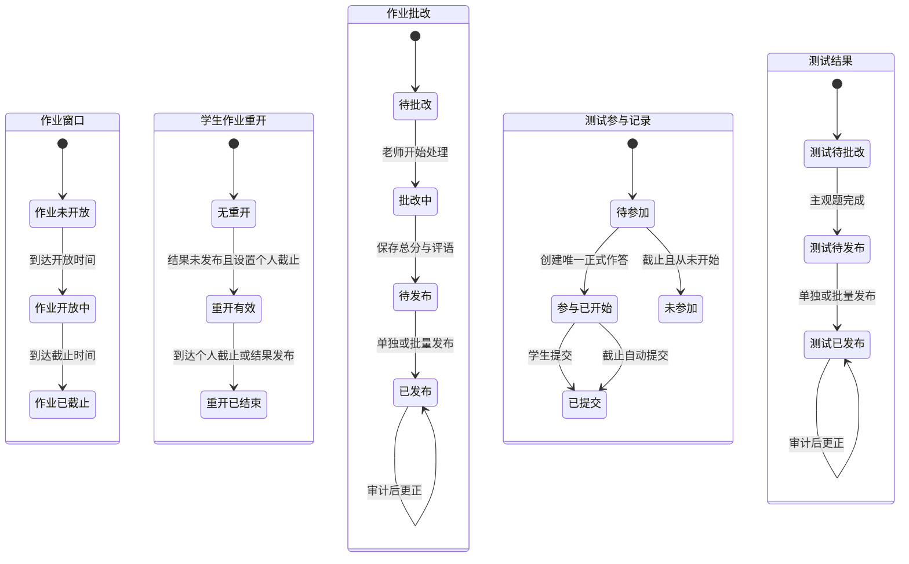
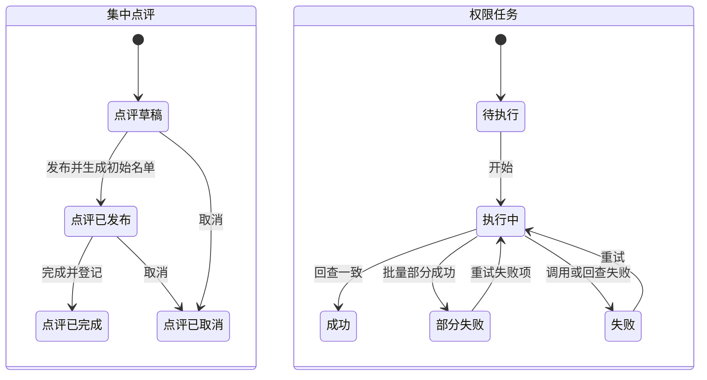

> 本文是 V1.0 产品行为的唯一 PRD。业务规则以
> [V1 业务规则基线](../../product/2026-07-18-v1-business-rules.md) 为上位依据；
> 旧“飞书多维表格权限中心”PRD 不再作为实施依据。

## 一、Summary 版本说明

1. 建立老师/管理员端与学生端，统一承载首期 15 名学生的课程运营。
2. 以课程共享阶段组织内容；首名学生进入后锁定排期，后补内容仍能幂等覆盖既有学生。
3. 学生通过邀请激活，后续用手机号密码登录并按飞书绑定、资料和服务事实续接。
4. 把飞书文档下发、撤回、补发、按来源恢复、反查、异常和个人陪跑文档纳入可审计闭环。
5. V1 采用统一直播排期，不实现滚动招生、个人自动排期或多课程报名。

---

## 二、Problem & Goals 问题与目标

### 2.1 业务背景

过去的课程按期招生，通过微信群、飞书群、公告文档和多维表格统一下发资料、直播链接、
作业与测试。课程结束后，再通过一对一群和学生专属飞书文档开展面试陪跑。信息分散、
权限依赖人工，且学生必须等待统一开课。

新版课程将逐步由直播转为录播并取消“期数”。未来学生会随报随学、进度不同，
老师则以一对多方式服务。首期课程仍使用统一直播排期，但必须先在统一教务系统中
跑通资料、课程、作业、测试、点评、服务和文档权限的完整业务闭环。

### 2.2 用户角色

| 角色   | 描述                                   | 主要诉求                               | 权限范围                          |
| ------ | -------------------------------------- | -------------------------------------- | --------------------------------- |
| 学生   | 受邀参加一门 GainFactor 课程的外部用户 | 查看本人课程、提交作业与测试、接收结果 | 仅本人记录和明确下发资源          |
| 老师   | 对课程教学和服务负责的内部成员         | 管理学生、内容、评分、点评和文档       | 负责课程；敏感资料限本人负责学生  |
| 助教   | 协助老师跟进节奏的内部成员             | 督促进度、协助运营与记录               | V1 同老师；敏感资料限本人负责学生 |
| 管理员 | 负责全局配置和账号治理的内部成员       | 管理全部课程、账号、例外与审计         | 全局；可看敏感资料历史并纠错      |

系统权限只区分管理员和普通内部成员；老师、助教是课程职责标签。每名学生至少有一名
负责老师，其他课程成员可选。老师与助教在一般课程功能中的权限相同；入学资料和简历属于
例外，普通内部成员只有在当前负责该学生时才能查看当前版本，不能因同属课程扩大访问范围。

### 2.3 业务目标（北极星指标 + KR）

**北极星指标：首期核心教务流程系统闭环率达到 100%。**

- **KR1：学生纳入率**从 0/15 提升至 15/15 完成建档并具备邀请条件。
- **KR2：流程覆盖率**从 0% 提升至阶段、作业、测试、点评全部通过系统产生正式记录。
- **KR3：权限结果覆盖率**达到 100%，每次下发/撤回均有结果，活跃文档外部变化
  最迟 5 分钟发现。
- **KR4：数据完整性**达到零不可恢复丢失；学生提交、答案、评分和服务记录均可追溯。
- **KR5：隐私隔离**保持零非授权跨学生访问事件。

### 2.4 非目标（No-gos · 本期明确不做）

- ❌ 不做班级、招生期数、滚动招生、相对时间或个人自动排期。
- ❌ 不允许一个学生报名多门课程。
- ❌ 不做学生飞书/微信登录、自助注册、注销或修改手机号。
- ❌ 不同步小鹅通观看进度，不记录学习单元完成度。
- ❌ 不根据作业、测试或点评结果自动推进阶段。
- ❌ 不做通用站内通知中心、未读红点或业务短信/飞书广播；文档权限开通所需的
  单张老师机器人任务卡除外。
- ❌ 不做飞书会议自动考勤。
- ❌ 不处理支付、合同、退款和发票，只记录必要状态。
- ❌ 不做题库、作业 Rubric、行内批注和点评附件。
- ❌ 不解析或同步飞书文档正文。
- ❌ 不迁移旧测试系统代码及历史答题数据。
- ❌ 不建设通用资料导入页面、可配置导入工具或持续同步飞书多维表格。
- ❌ 不建设多组织、多租户或对外售卖能力。

### 2.5 端到端流程图

---

## 三、Scope 需求范围

### 3.1 需求清单（按优先级排序）

| 序号 | 系统   | 功能                          | 类型 | 优先级 | 需求摘要                                       |
| ---: | ------ | ----------------------------- | ---- | ------ | ---------------------------------------------- |
|    1 | 内部端 | AUTH-01 内部登录与课程范围    | 新增 | P0     | 飞书登录；管理员全局、普通成员仅负责课程       |
|    2 | 学生端 | AUTH-02 邀请激活与手机密码    | 新增 | P0     | 7 天专属邀请、短信验证、设密与找回密码         |
|    3 | 双端   | FEISHU-01 飞书绑定与权限通道  | 新增 | P0     | 绑定码、机器人身份、联系人、真实文档开通与重试 |
|    4 | 内部端 | COURSE-01 课程与服务团队      | 新增 | P0     | 课程状态、课程代码、老师/助教及至少一名老师    |
|    5 | 双端   | STUDENT-01 学生、学号与主状态 | 新增 | P0     | 一人一课、课程流水学号、六个主状态             |
|    6 | 双端   | PROFILE-01 入学问卷与简历     | 新增 | P0     | 课程问卷、一份 PDF、自动通过、敏感访问审计     |
|    7 | 双端   | STAGE-01 共享阶段与学生阶段   | 新增 | P0     | 线性共享排期、实际记录、晚加入补建与人工例外   |
|    8 | 双端   | CONTENT-01 学习单元与发布     | 新增 | P0     | 草稿/发布/撤回、撤权及按原下发来源恢复         |
|    9 | 双端   | DOC-01 文档接入与下发         | 新增 | P0     | 独立文档、阶段任务、手动下发和学生阶段归属     |
|   10 | 内部端 | DOC-02 权限核验与异常         | 新增 | P0     | 三层权限事实、执行事实、5 分钟核验与异常       |
|   11 | 双端   | ASSIGN-01 作业闭环            | 新增 | P0     | 链接提交、版本、总分、文字评语和结果发布       |
|   12 | 双端   | TEST-01 测试闭环              | 新增 | P0     | 在线答题、自动保存、混合评分和逐题结果         |
|   13 | 双端   | REVIEW-01 集中点评            | 新增 | P0     | 独立时间、名单、手工考勤、会议和受控回放       |
|   14 | 双端   | SERVICE-01 服务生命周期       | 新增 | P0     | 150 天、暂停、恢复、延期、到期提示且继续访问   |
|   15 | 双端   | COACH-01 个人陪跑文档         | 新增 | P0     | 从课程知识库模板幂等创建并授予本人编辑         |
|   16 | 全局   | AUDIT-01 保留、逻辑删除与审计 | 新增 | P0     | 永久业务记录、敏感访问与关键操作留痕           |
|   17 | 全局   | GATE-01 外部飞书权限验收      | 新增 | P0     | 两个外部企业账号完成身份、授权、撤回与隔离测试 |
|   18 | 内部端 | BATCH-01 批量运营操作         | 新增 | P1     | 作业/测试结果批量发布、文档任务批量重试        |
|   19 | 内部端 | HISTORY-01 历史与异常筛选     | 新增 | P1     | 记录局部历史、全局审计和权限待处理筛选         |
|   20 | 内部端 | ANALYTICS-01 首期运营复盘     | 新增 | P2     | 查看激活、资料、任务结果和异常数量             |

> P0 是首期完整闭环；P1 提升小团队运营效率；P2 可在不影响首期运行时延后。
> 表内 `AUTH-01` 等是阅读友好的功能 ID；文首追溯元数据中的
> `REQ-GAINFACTOR-*` 是稳定机器 ID，两者通过 requirement title 一一对应。

### 3.2 非功能性需求

| 维度       | V1 要求                                                                                        |
| ---------- | ---------------------------------------------------------------------------------------------- |
| 规模       | 支持至少 5,000 名永久学生记录、50 名并发用户、2 门以上课程                                     |
| 性能       | 代表性预发布环境中以 50 个虚拟用户稳定运行 15 分钟；核心页面 P95 ≤ 2.5 秒，本地写 P95 ≤ 1.5 秒 |
| 统计口径   | 服务端端到端耗时；排除短信/飞书实际处理时间，但包含本地入队；预热后按 15 分钟窗口统计          |
| 外部任务   | 短信/飞书操作立即显示受理状态；最终结果、失败原因和重试状态可查询                              |
| 权限时效   | 系统写操作后立即回查；活跃文档差异 ≤ 5 分钟发现；冷文档每日核验                                |
| 可用性     | 月度服务端成功请求率目标 99.5%；计划维护和已识别第三方故障单独披露，不覆盖最近有效事实         |
| 数据完整性 | 学生提交、答案、评分、服务与权限记录不得不可恢复丢失                                           |
| 隐私       | 非授权跨学生访问为 0；敏感资料遵循最小可见并记录访问日志                                       |
| 保留       | 学生业务数据与关键审计永久保存；纯草稿无下游记录时才可物理删除                                 |
| 兼容       | 内部端支持主流桌面浏览器最近两个大版本；学生端适配主流移动浏览器                               |
| 安全       | 密码安全存储、短信验证码限流、邀请一次使用、密钥不得进入客户端或仓库                           |

性能、可用性和下文执行细则已经在 V1.0 终审中确认，作为开发、测试与上线验收口径。

---

## 四、Design 需求设计

### 4.1 业务对象关系

#### 4.1.1 业务对象总览

| 业务对象              | 业务定义                                         | 谁拥有            | 谁维护      |
| --------------------- | ------------------------------------------------ | ----------------- | ----------- |
| 内部账号              | 老师、助教或管理员的系统身份                     | GainFactor        | 管理员      |
| 内部 OAuth 身份       | 内部成员登录所用的应用/租户/用户绑定             | 内部账号          | 管理员      |
| GainFactor 应用机器人 | 接收外部学生消息并取得应用内身份                 | GainFactor        | 管理员/研发 |
| 全局飞书联络账号      | 接受外部联系并执行 V1 文档权限动作               | GainFactor        | 管理员      |
| 文档执行授权          | 联络账号授予应用的文档操作权限                   | 全局飞书联络账号  | 管理员/研发 |
| 课程                  | 长期存在的课程产品与内容边界                     | GainFactor        | 管理员      |
| 课程成员              | 内部成员在课程中的老师/助教职责                  | 课程              | 管理员      |
| 学生账号              | 学生登录系统的手机密码身份                       | 学生              | 管理员      |
| 课程学员记录          | 学生参加课程后的唯一服务关系                     | 课程              | 老师/管理员 |
| 邀请                  | 学生认领课程学员记录的一次性凭证                 | 课程学员记录      | 老师/管理员 |
| 飞书绑定码            | 手机验证后生成的短时一次性数字码                 | 课程学员记录      | 系统        |
| 问卷模板与资料        | 课程入学字段及学生提交结果                       | 课程/课程学员记录 | 老师/管理员 |
| 简历                  | 学生提交的一份敏感 PDF 及其版本                  | 课程学员记录      | 管理员纠错  |
| 飞书协作者身份        | 机器人事件绑定的应用内外部身份                   | 课程学员记录      | 系统        |
| 文档权限通道          | 学生真实文档授权能否成功的独立状态               | 课程学员记录      | 系统/老师   |
| 服务关系              | 学生明确开始日、结束日、暂停、延期及团队         | 课程学员记录      | 老师/管理员 |
| 课程阶段              | 课程内线性组织和共享排期事件                     | 课程              | 老师/管理员 |
| 学生阶段记录          | 学生与课程阶段的实际关联及例外                   | 课程学员记录      | 系统/老师   |
| 学习单元              | 名称、老师、时间和外部学习链接                   | 课程阶段          | 老师        |
| 飞书文档              | 独立接入的课程资源及允许权限                     | 课程              | 老师/管理员 |
| 阶段自动任务          | 可启停的阶段下发策略及既有学生补扫结果           | 课程阶段          | 老师        |
| 学生文档权限          | 唯一的学生与文档目标权限、阻断记录及实际权限关系 | 课程学员记录      | 系统/老师   |
| 学生阶段文档记录      | 文档在学生阶段下的组织记录及首次下发来源         | 学生阶段记录      | 系统/老师   |
| 作业与提交            | 阶段任务、学生链接版本及整份评分                 | 课程阶段/学生     | 老师/学生   |
| 学生作业重开记录      | 单学生新的截止时间、原因和有效状态               | 作业/课程学员记录 | 老师        |
| 测试                  | 阶段测试、题目、答案和结果规则                   | 课程阶段          | 老师        |
| 测试参与记录          | 学生对测试的待参加、已开始、已提交或未参加事实   | 课程学员记录      | 系统        |
| 测试正式作答          | 学生开始后创建的唯一答卷、答案和逐题评分         | 测试参与记录      | 老师/学生   |
| 集中点评              | 共享会议、应参加名单、考勤和回放                 | 课程阶段          | 老师        |
| 个人陪跑文档          | 从课程模板创建的学生专属文档                     | 课程学员记录      | 系统/老师   |
| 个人陪跑文档配置      | 每课程唯一的触发阶段与知识库模板配置             | 课程              | 老师/管理员 |
| 个人陪跑文档创建任务  | 每学生创建、授权和重试唯一文档的幂等执行实例     | 学生阶段记录      | 系统/老师   |
| 审计记录              | 敏感访问与关键业务变化的永久证据                 | GainFactor        | 系统        |

#### 4.1.2 关系图

#### 4.1.3 业务对象生命周期

**课程与内容**

归档课程不再创建新邀请，既有学生仍可访问。通用内容已产生下游记录后不能物理删除。
作业定义和测试定义也遵循通用内容状态，但该状态分别独立于作业窗口、测试参与/正式作答和结果发布；
测试首名学生开始后不得再撤回定义。
阶段自动内容首次发布或自动任务启用时，立即扫描对应阶段已经开放的学生阶段记录，
包括进行中、已结束和已结束补建，排除已禁用学生；平台内容立即生效，引用飞书文档时
为每个“学生 × 文档”至多创建一条幂等任务。之后进入阶段的学生仍由进入事件触发。
撤回引用飞书文档的内容时，学生端入口立即隐藏，同时为相关学生创建实际撤权任务；
失败或未知项持续重试并告警，权限任务只有在回查确认无权限后才完成。
重新发布不直接写入飞书权限，只处理撤回前已有的下发记录。存在阶段自动来源且学生仍
符合授权条件时，为同一“学生 × 文档”创建一条幂等授权任务；全部为老师手动来源时
保持无权限，等待老师手动重新授权。撤回期间新增学生不进入恢复批次，重新发布事务
为其创建的授权任务数必须为 0；之后仅在内容已发布且满足阶段条件时走正常阶段任务。
人工撤回、账号禁用或其他未解除的内容撤回优先；授权并回查成功前入口继续隐藏。
同一内容发布版本、学生文档权限和授权动作在同轮只创建一条恢复任务，重复发布和重试复用。

**邀请与学生主状态**

学生设密后统一使用手机号和密码登录；已使用邀请转到登录页。登录后按事实续接飞书绑定、
问卷或课程，短信重置密码后全部旧会话失效且不改变业务事实。
解除禁用后，系统按账号激活、资料与服务日期重新计算主状态，不将“已禁用”
当作服务生命周期的一部分。

**学生飞书身份绑定与文档权限通道**

学生登录身份、应用内飞书身份和文档权限通道必须分开保存。机器人从已登录学生的一次性
绑定码消息中取得本应用 `open_id`，冲突检查通过即绑定并永久锁定；不得按姓名、手机号、
旧问卷线索或人工录入的候选 ID 建立绑定。V1 不提供任何解绑、纠错或替换入口。

“已绑定”即可开放问卷并允许创建首份真实文档授权任务；不要求先用隐藏文档完成权限闭环。
文档权限通道只有在真实应下发文档授权并回查一致后才为“已开通”。失败时学生端仍只显示
“待开通”，后台持续幂等重试，超过 24 小时产生内部告警，但不影响问卷完成后的课程访问。

**服务、课程阶段与学生阶段**

延期只改变服务结束日期，不增加服务状态。暂停当日不计服务天数，恢复当日重新计入；
暂停仅顺延个人服务结束日，不改变课程阶段或作业、测试、点评时间。
服务开始日由老师或管理员创建学员时填写，发送邀请前必须确认；开始日计第 1 天，
默认结束日为开始日加 149 个自然日。

学生阶段例外不修改课程阶段共享时间。提前开放或延后只改变指定学生的阶段记录；
允许学生阶段重叠，首页当前阶段取进行中的最高顺序阶段，较早阶段继续可访问。
首名学生实际进入某阶段后，该阶段顺序及共享开放、结束时间锁定；未进入阶段仍可修改，
但只能排在最后一个已锁定阶段之后。锁定不影响老师补充内容或设置单学生例外。
学生实际进入阶段时触发已经启用的阶段自动任务；任务晚启用时补扫既有可访问学生阶段，
两条触发路径命中同一关系时必须幂等。业务任务各自的时间不自动变化。

**作业与测试**

单学生重开只生成个人截止时间，不改变作业共享窗口；结果发布前才能重开。V1 不支持取消
有效重开，个人截止到达或结果发布后结束。产生新提交版本后，批改回到待批改，旧提交和
旧评分保留历史。结果发布后不得重开，只能审计更正。
每名学生对每份测试只有一次正式作答；提交或截止自动提交后即结束，任何角色都不能
重开、重置或再次创建作答。测试发布后建立测试参与记录；只有学生开始时才创建正式答卷。
从未开始者截止后把参与记录标记未参加，不创建空白答卷或零分结果。
学生在测试截止后才进入对应阶段时不属于该测试截止批次，不创建测试参与记录或正式作答；
学生端显示“已过期”并禁止进入。它与“截止前已有参与记录但从未开始”的“未参加”不同。
任一学生开始后，题目、选项、答案和分值锁定，测试定义不得撤回。

**集中点评与权限任务**

点评名单在发布时纳入已关联对应阶段且主状态为待开始、进行中或已暂停的学生，排除
待加入、已结束、已禁用和作废记录；开始前允许增删，到达开始时间后冻结。冻结后提交
作业的学生不自动加入本场。

文档权限不能压缩为单一状态。有效访问由目标权限、阻断记录、飞书协作者权限和
文档总权限共同决定；首次下发来源与任务执行结果独立保存：

| 事实             | 允许值                                     | 用途                                 |
| ---------------- | ------------------------------------------ | ------------------------------------ |
| 目标权限         | 只读、编辑                                 | 保存撤回前应恢复的权限类型           |
| 权限阻断记录     | 可并存多条：内容撤回、人工撤回、因禁用暂停 | 每条独立有效；内容撤回关联内容和版本 |
| 首次下发来源     | 阶段自动、老师手动                         | 保存在学生阶段文档记录，决定恢复方式 |
| 飞书协作者权限   | 只读、编辑、不存在、未知                   | 表示协作者列表最近一次返回           |
| 文档总权限       | 允许组织外协作者、禁止组织外协作者、未知   | 表示文档公共设置是否阻断外部访问     |
| 权限任务执行结果 | 待执行、执行中、成功、部分失败、失败       | 表示一次下发、撤回或重新授权是否完成 |

页面根据目标权限、有效阻断记录、协作者权限和文档总权限派生“正常、异常、受总权限限制、
未知”，不得用任务成功替代飞书实际权限，也不得在文档总权限未知时展示为正常。

#### 4.1.4 业务规则清单

以下规则直接继承已确认的 BRD 与业务规则基线；其中性能、活跃文档、业务时区、会话失效、
最后管理员保护、人工回放证据和止损口径均已在 V1.0 终审中确认。

|   # | 业务规则                                                                                                                                                                                                                                                                                      | 涉及对象                                             |
| --: | --------------------------------------------------------------------------------------------------------------------------------------------------------------------------------------------------------------------------------------------------------------------------------------------- | ---------------------------------------------------- |
|   1 | V1 一个学生账号最多关联一份课程学员记录                                                                                                                                                                                                                                                       | 学生账号、课程学员记录                               |
|   2 | 学号为 `课程代码-流水号`，从 001 开始、自然扩位且永不复用；首个学号生成后课程代码锁定                                                                                                                                                                                                         | 课程、课程学员记录                                   |
|   3 | 普通内部成员仅访问负责课程；老师与助教在一般课程功能中权限一致，但入学资料和简历按学生当前负责服务团队进一步收窄                                                                                                                                                                              | 内部账号、课程成员、服务关系、学生资料、简历         |
|   4 | 每名学生至少配置一名负责老师，其他老师和助教可选                                                                                                                                                                                                                                              | 课程学员记录、课程成员                               |
|   5 | 预建学员与生成邀请是两个独立动作：预建创建学员记录、永久学号、服务关系和团队且不自动生成邀请；老师或管理员之后单独生成 7 天一次性邀请，生成时重新确认课程未归档、服务开始日和止邀状态；邀请只允许预留手机号激活，设密成功即使用，后续手机号密码登录并按入学事实续接，短信重置使全部旧会话失效 | 课程学员记录、服务关系、邀请、学生账号               |
|   6 | 手机验证设密后须先完成机器人飞书绑定；绑定后开放问卷，必填问卷和一份合规 PDF 简历完成后自动通过并进入课程                                                                                                                                                                                     | 学生账号、飞书绑定码、飞书协作者身份、学生资料、简历 |
|   7 | 简历最大 10 MB；提交后学生本人不能查看、下载、修改或删除                                                                                                                                                                                                                                      | 简历                                                 |
|   8 | 该学生当前负责服务团队中的老师和助教只能查看当前资料与当前简历；管理员可查看当前与历史并纠错；其他课程成员拒绝访问，所有敏感访问留痕                                                                                                                                                          | 服务关系、学生资料、简历、审计记录                   |
|   9 | 课程阶段线性排序，开放/结束时间共享；首名学生进入后锁定该阶段顺序和共享时间，未进入阶段只能在最后一个锁定阶段之后调整                                                                                                                                                                         | 课程阶段                                             |
|  10 | 作业、测试、点评各有独立共享时间，彼此不强制关联                                                                                                                                                                                                                                              | 作业、测试、集中点评                                 |
|  11 | 阶段按时间推进，作业、测试或点评结果不构成阶段门禁                                                                                                                                                                                                                                            | 课程阶段                                             |
|  12 | 学生阶段保存关联、实际时间和例外，不反向修改课程排期                                                                                                                                                                                                                                          | 学生阶段记录                                         |
|  13 | 晚加入学生进入当前阶段，历史阶段补建但不伪造完成                                                                                                                                                                                                                                              | 学生阶段记录                                         |
|  14 | 历史作业/测试默认关闭；作业结果发布前可用个人截止时间重开单名学生，新提交回到待批改；结果发布后只允许更正；测试禁止重开、重置或再次作答                                                                                                                                                       | 作业、测试                                           |
|  15 | 阶段开始后允许继续发布内容；首次发布或任务启用时补扫进行中、已结束和补建学生阶段，排除禁用并幂等生效，未来进入者继续走进入任务                                                                                                                                                                | 通用内容、阶段自动任务                               |
|  16 | 撤回引用飞书文档的内容时立即隐藏入口并撤销相关学生实际权限；同文档仍在其他阶段出现也不保留；失败或未知项持续重试并告警，回查无权限后任务才完成                                                                                                                                                | 通用内容、学生文档权限                               |
|  17 | 文档独立于课程阶段；阶段任务可由学生进入或任务晚启用补扫触发，两条路径命中同一“学生 × 文档”时幂等；手动动作独立                                                                                                                                                                               | 飞书文档、阶段自动任务                               |
|  18 | 手动下发必须选择该学生已存在的学生阶段记录                                                                                                                                                                                                                                                    | 学生阶段文档记录                                     |
|  19 | 每个“学生 × 文档”只有一条实际权限关系，可被多个阶段记录复用                                                                                                                                                                                                                                   | 学生文档权限                                         |
|  20 | 学生级人工撤回优先于重新发布和阶段自动任务，只有老师主动重新授权才能解除                                                                                                                                                                                                                      | 学生文档权限                                         |
|  21 | 文档允许权限类型变更只影响后续下发，既有权限不自动同步                                                                                                                                                                                                                                        | 飞书文档、学生文档权限                               |
|  22 | 飞书为实际权限事实源；写后回查、活跃 5 分钟、冷文档每日核验                                                                                                                                                                                                                                   | 学生文档权限                                         |
|  23 | 存在任一未受阻断的学生目标权限或最近观测协作者的文档为活跃文档；与账号启用状态无关                                                                                                                                                                                                            | 飞书文档                                             |
|  24 | 查询失败显示未知；关闭组织外协作者访问时保留逐学生关系                                                                                                                                                                                                                                        | 飞书文档、学生文档权限                               |
|  25 | 禁用默认勾选撤回全部文档；可取消；恢复可选恢复本次成功撤回项，默认不勾选，也不补发错过任务                                                                                                                                                                                                    | 学生账号、学生文档权限                               |
|  26 | 禁用后外部重新授权只告警和审计，不自动撤回                                                                                                                                                                                                                                                    | 学生账号、学生文档权限                               |
|  27 | 作业只提交一条飞书链接；平台不代管学生自有文档权限                                                                                                                                                                                                                                            | 作业提交                                             |
|  28 | 作业默认满分 100，采用一项总分和一段文字评语，不做逐题或 Rubric                                                                                                                                                                                                                               | 作业批改                                             |
|  29 | 测试客观题自动评分、主观题人工评分，发布后默认展示标准答案                                                                                                                                                                                                                                    | 测试、测试结果                                       |
|  30 | 点评发布时纳入已关联阶段且主状态为待开始、进行中或已暂停的学生，排除待加入、已结束、已禁用和作废记录；开始前可增删，开始时冻结                                                                                                                                                                | 集中点评                                             |
|  31 | 点评回放发给冻结后的应参加名单，与是否到场或交作业无关                                                                                                                                                                                                                                        | 集中点评                                             |
|  32 | 服务暂停日不计入服务天数，恢复日重新计入；暂停只顺延个人服务结束日，不影响课程阶段或作业、测试、点评排期                                                                                                                                                                                      | 服务关系                                             |
|  33 | 服务自然结束不禁用账号、不撤文档，继续显示既有内容                                                                                                                                                                                                                                            | 服务关系、学生账号                                   |
|  34 | 每门课程维护一条个人陪跑文档配置，显式绑定触发阶段与知识库模板且不依赖名称；每名学生进入该阶段时生成独立创建任务，老师可提前触发；失败按学生重试、重复触发复用任务且文档仍只有一份，授权回查成功前不展示入口；学生只获单页编辑权                                                              | 个人陪跑文档配置、个人陪跑文档创建任务、个人陪跑文档 |
|  35 | 账号禁用或密码重置后现有系统会话立即失效，所有不再有效的会话请求被拒绝                                                                                                                                                                                                                        | 学生账号                                             |
|  36 | 业务时间统一使用 Asia/Shanghai，以服务端时间判断边界                                                                                                                                                                                                                                          | 全部时间对象                                         |
|  37 | 产生业务历史后不得物理删除，只能作废、撤回、取消、归档或禁用                                                                                                                                                                                                                                  | 全部业务对象                                         |
|  38 | 回放人工确认至少记录操作者、时间、名单、结果和资源链接                                                                                                                                                                                                                                        | 集中点评、审计记录                                   |
|  39 | 绑定码为 6 位数字、10 分钟有效、一次使用、最多连续错误 5 次；重发后旧码立即失效                                                                                                                                                                                                               | 飞书绑定码                                           |
|  40 | 机器人消息事件取得本应用 `open_id` 且冲突检查通过即绑定；禁止姓名/手机号匹配、候选 ID、隐藏验证文档和老师二次确认；绑定后任何角色均不能更换                                                                                                                                                   | 飞书协作者身份、课程学员记录                         |
|  41 | 课程资料与作业模板固定只读；个人陪跑文档固定编辑；学生不能选择权限                                                                                                                                                                                                                            | 飞书文档、个人陪跑文档                               |
|  42 | 提前开放只覆盖该学生阶段开放时间；延后结束时间优先于共享结束时间；允许阶段重叠；“当前阶段”取仍在进行中的最高顺序阶段，较早阶段继续展示；阶段任务按实际进入触发，业务任务时间不自动变化                                                                                                        | 学生阶段记录、阶段自动任务                           |
|  43 | 多选题只有选项集合完全一致才得满分，少选、多选或错选均为 0 分；测试可选配置及格线                                                                                                                                                                                                             | 测试、题目                                           |
|  44 | 付款与合同各仅记录“未确认/已确认”，由老师或管理员手工维护，不触发流程                                                                                                                                                                                                                         | 服务关系                                             |
|  45 | 内部登录 OAuth、应用机器人和全局联络账号的文档执行授权必须分别记录用途、应用/租户/用户标识、状态与授权范围，不合并为一个“飞书凭证”                                                                                                                                                            | 内部 OAuth 身份、GainFactor 应用机器人、文档执行授权 |
|  46 | 应用密钥和令牌只存安全配置；业务库只存引用与授权元数据；V1 文档权限统一由张源账号的用户授权执行，失效时阻断且不静默切换其他老师                                                                                                                                                               | 全局飞书联络账号、文档执行授权、审计记录             |
|  47 | 已绑定学生在首份真实应下发文档上授权并回查一致后，文档权限通道才从待开通变为已开通；没有真实文档时不得创建隐藏验证文档                                                                                                                                                                        | 文档权限通道、学生文档权限                           |
|  48 | 学生按钮、发给张源的唯一老师任务卡片和后台定时重试触发同一幂等开通任务；后台重试不重复发卡，任务不自动失效                                                                                                                                                                                    | 文档权限通道、权限任务                               |
|  49 | 自首份真实文档首次权限任务创建起连续 24 小时未开通时，仅产生内部待处理告警；尚无真实文档时不计时；不阻断问卷完成后的课程访问，学生端只显示待开通或已开通                                                                                                                                      | 文档权限通道、学生课程页面                           |
|  50 | 系统不能直接把一般授权失败解释为联系人未通过；联系人或同组织可见关系只以真实文档授权成功作为正向证明                                                                                                                                                                                          | 全局飞书联络账号、文档权限通道                       |
|  51 | 内容重新发布只关闭本次内容及撤回版本的阻断记录，不直接赋权；存在阶段自动来源时为撤回前已有且仍符合条件的记录创建一条幂等授权任务，全部为老师手动来源时等待手动恢复；其他阻断不得覆盖；同一发布版本、学生文档权限和授权动作同轮只生成一条任务；撤回期间新增学生不进入恢复批次                  | 通用内容、学生阶段文档记录、学生文档权限             |
|  52 | 作业定义和测试定义各自采用草稿、已发布、已撤回状态，并与时间窗口、提交/作答及结果发布状态独立；测试首名学生开始后定义锁定且不得撤回                                                                                                                                                           | 作业、测试、作答、结果                               |
|  53 | 测试发布后为截止前已进入对应阶段的学生建立参与记录，开始时才创建正式作答；截止时只自动提交已开始的作答，已有参与记录但从未开始者标记未参加且不创建空白答卷或零分结果；截止后才进入阶段者只显示已过期，不创建参与记录或正式作答                                                                | 学生阶段记录、测试参与记录、测试正式作答、测试结果   |
|  54 | 服务开始日创建学员时填写、发邀请前确认；开始日计第 1 天，默认结束日为开始日加 149 天；主状态只由入学完成与服务日期计算，不依赖阶段                                                                                                                                                            | 课程学员记录、服务关系、学生主状态                   |

#### 4.1.5 对象-页面映射

| 业务对象                           | 展示页面                         | 操作页面                 |
| ---------------------------------- | -------------------------------- | ------------------------ |
| 内部账号、课程成员                 | 内部登录与课程列表、课程概览     | 课程设置、内部账号管理   |
| 内部 OAuth/应用机器人/文档执行授权 | 内部账号与全局审计、文档权限中心 | 飞书身份配置             |
| 课程、课程阶段、学习单元、阶段任务 | 课程概览、学生课程首页           | 课程结构与内容、文档中心 |
| 课程学员记录、邀请、飞书绑定码     | 学生列表、学生详情、学生入学流程 | 创建学生与邀请           |
| 问卷模板、学生资料、简历           | 学生详情、学生入学流程           | 问卷模板、管理员纠错     |
| 服务关系、学生阶段记录             | 学生列表、学生详情、学生首页     | 学生详情、课程阶段设置   |
| 飞书身份、权限通道、学生文档权限   | 文档权限中心、学生详情、学生阶段 | 文档权限中心、学生详情   |
| 作业、提交、重开记录、批改         | 作业工作台、学生作业页           | 作业工作台、学生详情     |
| 测试、作答、结果                   | 测试工作台、学生测试页           | 测试工作台               |
| 集中点评、参与记录                 | 点评工作台、学生点评页           | 点评工作台               |
| 个人陪跑文档及创建任务             | 学生详情、学生服务与资料页       | 学生详情、失败任务重试   |
| 审计记录                           | 记录局部历史、管理员全局审计     | 系统自动写入             |

### 4.2 页面功能详细设计

#### 4.2.1 内部登录与课程列表

| 维度     | 说明                                                                                 |
| -------- | ------------------------------------------------------------------------------------ |
| 业务场景 | 内部成员通过 GainFactor 飞书身份进入本人可管理课程                                   |
| 页面布局 | 飞书登录入口；登录后显示账号区、课程卡片和课程状态                                   |
| 关键字段 | 内部成员、OAuth 应用/租户/用户绑定、系统角色、课程名称、课程代码、课程状态、课程职责 |
| 交互动作 | 飞书登录；进入课程；退出登录；管理员进入账号管理                                     |
| 状态变化 | 内部账号启用/禁用；课程草稿/启用/归档                                                |
| 异常处理 | 账号未预建、已禁用、OAuth 失败、无负责课程时给出明确原因                             |
| 验收点   | ① 普通成员仅见负责课程 ② 管理员见全部课程 ③ 禁用账号不能进入                         |

#### 4.2.2 课程概览

| 维度     | 说明                                                              |
| -------- | ----------------------------------------------------------------- |
| 业务场景 | 老师快速掌握当前阶段、学生分布和待处理异常                        |
| 页面布局 | 课程头部；当前阶段；学生状态卡；近期作业/测试/点评；异常筛选入口  |
| 关键字段 | 课程状态、当前阶段、六类学生状态数量、近期时间、权限异常数量      |
| 交互动作 | 进入学生列表；进入内容工作台；按异常类型查看待处理记录            |
| 状态变化 | 只展示课程、阶段和任务的实际状态，不在概览直接改状态              |
| 异常处理 | 外部数据未知时显示最后核验时间，不把未知计为正常                  |
| 验收点   | ① 数量可反查明细 ② 无红点/未读逻辑 ③ 异常入口可筛到具体学生或文档 |

#### 4.2.3 学生列表、预建与创建邀请

| 维度     | 说明                                                                                                                                  |
| -------- | ------------------------------------------------------------------------------------------------------------------------------------- |
| 业务场景 | 老师或管理员先预建学员，再按需要单独发邀请，并按服务或进度定位学生                                                                    |
| 页面布局 | 状态统计；筛选区；学生表格；创建学生弹窗；邀请详情抽屉                                                                                |
| 关键字段 | 姓名、手机号、学号、主状态、当前阶段、负责老师、服务开始/结束日、文档异常                                                             |
| 交互动作 | 预建学生并填写服务开始日、团队；稍后单独生成/复制邀请；查看待加入原因；打开详情；作废误建记录                                         |
| 状态变化 | 待加入→待开始；未激活记录→作废；邀请有效→使用/过期/失效                                                                               |
| 异常处理 | 重复手机号、第二门课程、课程代码/负责老师/服务开始日缺失时拒绝预建；课程归档、开始日不符或止邀时拒绝生成邀请                          |
| 验收点   | ① 预建生成学号、服务关系和团队但不生成邀请 ② 学号递增不复用 ③ 首个学号后课程代码只读 ④ 生成邀请时重新校验 ⑤ 邀请一次使用 ⑥ 六态可筛选 |

#### 4.2.4 学生详情

| 维度     | 说明                                                                                                                                 |
| -------- | ------------------------------------------------------------------------------------------------------------------------------------ |
| 业务场景 | 管理员或当前负责团队围绕单名学生处理资料、服务、阶段、结果、飞书绑定和文档权限通道                                                   |
| 页面布局 | 学生头部；概览、资料、服务、阶段、飞书身份、文档、作业、测试、点评、历史页签                                                         |
| 关键字段 | 主状态、当前阶段、学号、负责团队、服务开始/原结束/新结束日、计日预览、掩码身份、权限通道、个人文档创建任务                           |
| 交互动作 | 按权限查看资料；调整团队；纠错开始日；暂停/恢复/延期；重试权限或个人文档；设置阶段例外/作业重开；下发/撤回；禁用/恢复                |
| 状态变化 | 身份绑定、权限通道、服务、学生阶段、文档权限和账号状态分别流转，不互相覆盖                                                           |
| 异常处理 | 未绑定禁止问卷和授权；非当前负责成员拒绝敏感资料；开始日生效后纠错须管理员和原因；无效重开截止拒绝；个人文档失败可重试；绑定不可编辑 |
| 验收点   | ① 敏感资料按当前负责团队收窄 ② 绑定不可更换 ③ 开始日+149 天正确 ④ 重试不重复建文档 ⑤ 动作留痕 ⑥ 数据不串课 ⑦ 禁用立即失效            |

首期学生入学和飞书绑定采用以下唯一正式流程，不把旧多维表格或隐藏文档作为身份依据：

1. 老师或管理员预建姓名、手机号、服务开始日、课程学员记录和负责团队；系统生成永久学号，
   不自动创建邀请。
2. 老师或管理员之后单独生成 7 天一次性邀请。生成时重新确认课程未归档、服务开始日有效且
   止邀开关关闭；任一条件不满足时保留预建记录并拒绝生成邀请。
3. 学生用预留手机号完成短信验证并设置密码，邀请立即标记已使用；后续统一用手机号密码登录。
4. 页面先引导学生添加全局飞书联络账号，再生成 6 位绑定码并打开“教务管理系统”机器人。
5. 绑定码有效 10 分钟、一次使用、最多连续错误 5 次；重发后旧码立即失效。
6. 机器人收到有效码后，以消息事件中的本应用 `open_id` 与当前课程学员记录原子绑定。
   若该身份已属于其他学生则拒绝且不覆盖；成功后立即开放问卷。
7. 绑定一经成功，学生、老师和管理员都不能修改、解绑或重新绑定。发现错绑时禁用账号、
   撤回已有文档权限并线下处理。
8. 登录后按事实续接未完成步骤。学生完成问卷必填项和一份合规 PDF 简历后进入课程。
   上线前旧问卷仅作核对；一次性初始化只写姓名、预留手机号、课程、负责老师、服务开始日
   并生成学号，不写旧答案、旧简历或旧飞书字段，不完成入学状态。
9. 首份真实飞书文档达到下发条件后创建一条权限通道任务，并向张源发送一张老师机器人卡片；
   学生按钮、老师卡片和后台重试执行同一幂等任务。真实授权并回查一致后标记“已开通”。
10. 暂无真实文档时保持“待开通”且不计时；失败后持续重试，自首次权限任务创建起
    24 小时仍未成功时在老师后台告警。权限通道不阻断学生进入课程，且系统不得把一般
    失败直接解释为未添加联系人。

G2 全部门槛通过前，本流程仍只允许首期受控启用，不扩大到更多外部企业账号。

#### 4.2.5 课程结构与内容

| 维度     | 说明                                                                                         |
| -------- | -------------------------------------------------------------------------------------------- |
| 业务场景 | 老师配置线性阶段、共享时间和学习单元                                                         |
| 页面布局 | 课程信息；阶段列表；阶段详情；学习单元编辑；关联业务入口                                     |
| 关键字段 | 课程代码及锁定状态、阶段名称/顺序/说明/时间/锁定原因、学习单元与内容状态                     |
| 交互动作 | 新增阶段；仅调整未进入阶段；设置未锁定共享时间；补充内容；发布/撤回/重新发布                 |
| 状态变化 | 课程草稿/启用/归档；阶段未开放/进行中/已结束；内容草稿/发布/撤回                             |
| 异常处理 | 已锁定阶段禁用顺序和共享时间编辑并说明原因；撤权失败重试；重新发布不覆盖其他阻断             |
| 验收点   | ① 首生进入后排期锁定 ② 未进入阶段仅在锁定阶段后调整 ③ 后补内容可发布 ④ 撤回撤权 ⑤ 按来源恢复 |

#### 4.2.6 入学问卷模板

| 维度     | 说明                                                       |
| -------- | ---------------------------------------------------------- |
| 业务场景 | 老师为课程维护一次性入学资料收集模板                       |
| 页面布局 | 字段列表；字段编辑抽屉；排序区；模板预览                   |
| 关键字段 | 字段标题、单行/多行/单选/多选/日期、选项、必填、启用、顺序 |
| 交互动作 | 新增、复制、排序、停用字段；预览学生填写效果               |
| 状态变化 | 字段启用/停用；已提交资料不因模板变更被覆盖                |
| 异常处理 | 空标题、选择题无选项、删除已有提交字段时改为停用           |
| 验收点   | ① 五种字段可用 ② 必填阻止提交 ③ 模板变更不改历史答案       |

#### 4.2.7 文档与权限中心

| 维度     | 说明                                                                                                                            |
| -------- | ------------------------------------------------------------------------------------------------------------------------------- |
| 业务场景 | 老师接入课程文档并处理通道开通、下发、撤回、核验和异常                                                                          |
| 页面布局 | 文档列表；健康筛选；文档详情；学生权限表；通道任务、权限任务与核验历史                                                          |
| 关键字段 | 文档名称/链接/权限、阶段任务状态、补扫候选/任务/受阻/跳过数、执行授权、通道、目标权限、阻断、来源、实际权限、任务结果、核验时间 |
| 交互动作 | 接入文档；启用/停用阶段任务；确认既有学生补扫；验证并下发；手动下发/撤回/重授；刷新；重试失败项                                 |
| 状态变化 | 通道待开通/已开通；文档草稿/发布/撤回；权限任务待执行/执行中/成功/部分失败/失败                                                 |
| 异常处理 | 未绑定拒绝；重复启用复用任务；禁用学生不进补扫；查询失败显示未知；撤权失败重试；重新发布不覆盖其他阻断；总权限异常只提示        |
| 验收点   | ① 晚启用补扫既有阶段 ② 重复启用幂等 ③ 三入口同一任务 ④ 固定权限正确 ⑤ 撤回撤权 ⑥ 重新发布分流 ⑦ 活跃差异 5 分钟发现             |

个人陪跑文档拆分为课程级配置和学生级创建任务：每门课程的唯一配置明确选择一个触发阶段
和一个课程知识库模板，不按阶段名称识别；每名学生进入触发阶段或老师提前执行时，生成或
复用该学生的独立幂等创建任务。

#### 4.2.8 作业工作台

| 维度     | 说明                                                                                       |
| -------- | ------------------------------------------------------------------------------------------ |
| 业务场景 | 老师发布作业、查看链接版本并完成整份批改                                                   |
| 页面布局 | 作业列表；配置区；学生提交表；批改抽屉；发布确认                                           |
| 关键字段 | 内容状态、共享开放/截止、个人重开截止/原因、满分、提交版本、权限异常、总分、评语、批改状态 |
| 交互动作 | 发布/撤回；结果发布前单学生重开并设新截止；标异常；保存批改；单独/批量发布；发布后更正     |
| 状态变化 | 内容草稿/发布/撤回；共享窗口；个人重开；批改待批改/批改中/待发布/已发布                    |
| 异常处理 | 结果已发布拒绝重开；无效个人截止拒绝；撤回保留历史；超时、空/非法链接和权限异常明确处理    |
| 验收点   | ① 内容/窗口/结果独立 ② 重开只影响一人 ③ 新版本回待批改 ④ 发布后只更正 ⑤ 历史完整           |

#### 4.2.9 测试工作台

| 维度     | 说明                                                                                                                        |
| -------- | --------------------------------------------------------------------------------------------------------------------------- |
| 业务场景 | 老师配置在线测试、完成主观评分并发布逐题结果                                                                                |
| 页面布局 | 测试列表；题目编辑；预览；作答进度；逐题批改；发布确认                                                                      |
| 关键字段 | 测试定义状态、时间、题目/答案/解析、总分、及格线、未开始/作答/未参加/已过期、自动保存、逐题评分、结果状态                   |
| 交互动作 | 发布；首人开始前撤回/编辑；复制整份；查看作答/未参加；人工评分；单独/批量发布结果；审计更正                                 |
| 状态变化 | 定义草稿/发布/撤回；未开始/作答中/已提交/未参加；截止后才进入阶段者显示已过期；结果待批改/待发布/已发布；首人开始后定义锁定 |
| 异常处理 | 截止只提交已开始作答；已有参与记录但未开始者标未参加；截止后才进入阶段者拒绝进入且不建参与记录；禁止重开；多选不完全得 0    |
| 验收点   | ① 定义/作答/结果独立 ② 五题型 ③ 一次作答 ④ 未参加与已过期边界正确且均无空答卷 ⑤ 首人后不能撤回 ⑥ 结果发布前后权限正确       |

#### 4.2.10 集中点评工作台

| 维度     | 说明                                                                                       |
| -------- | ------------------------------------------------------------------------------------------ |
| 业务场景 | 老师安排共享点评、确认应参加名单、登记考勤并下发回放                                       |
| 页面布局 | 点评列表；时间和会议配置；应参加名单；考勤表；回放权限区                                   |
| 关键字段 | 开始/结束、会议链接、状态、默认有效状态集合、应参加、实际出席、备注、回放结果              |
| 交互动作 | 发布/取消/完成；开始前增删名单；登记考勤；API 下发或人工确认回放                           |
| 状态变化 | 草稿→已发布→已完成；草稿/已发布→已取消；名单在开始时冻结                                   |
| 异常处理 | 无人参加仍可取消；开始后名单不可改；后提交者不自动加入；回放失败逐人显示                   |
| 验收点   | ① 默认仅纳入待开始/进行中/暂停且已关联阶段学生 ② 开始前可增删、开始时冻结 ③ 缺席者仍获回放 |

#### 4.2.11 内部账号与全局审计

| 维度     | 说明                                                                                     |
| -------- | ---------------------------------------------------------------------------------------- |
| 业务场景 | 管理员管理内部人员、机器人身份、文档执行授权及全局关键操作                               |
| 页面布局 | 内部账号；课程职责；飞书身份配置；审计筛选与详情                                         |
| 关键字段 | 内部 OAuth、机器人应用/外部消息状态、全局联络账号、文档用户授权范围/刷新状态、审计前后值 |
| 交互动作 | 预建/禁用内部账号；分配课程；维护非密钥身份元数据；重新授权文档权限；查询审计            |
| 状态变化 | 内部账号、机器人能力和文档执行授权分别启用/失效；课程职责新增/移除                       |
| 异常处理 | 密钥和令牌仅存安全配置；张源授权失效时阻断新任务且不静默换老师；禁止禁用最后一名管理员   |
| 验收点   | ① 三类主体不混用 ② 登录/机器人绑定/文档任务均可追溯实际主体 ③ 普通老师无全局审计权限     |

#### 4.2.12 学生登录、激活与入学资料

| 维度     | 说明                                                                                                                 |
| -------- | -------------------------------------------------------------------------------------------------------------------- |
| 业务场景 | 学生完成首次激活，或通过手机号密码登录后从未完成的飞书绑定、资料或课程步骤继续                                       |
| 页面布局 | 登录/忘记密码；邀请校验；短信/设密；添加联络账号；绑定码/机器人；问卷；PDF 上传；完成页                              |
| 关键字段 | 手机号、验证码、密码、邀请状态、入学进度、绑定码倒计时/结果、飞书绑定、问卷、PDF、服务开始日                         |
| 交互动作 | 登录；短信重置；邀请激活；按状态续接；添加联络账号；绑定/重发；填写问卷；上传并最终提交                              |
| 状态变化 | 邀请有效→已使用；会话有效→重置后失效；飞书未绑定→已绑定；资料未完成→完成；主状态按服务日计算                         |
| 异常处理 | 已使用邀请转登录；错误密码/验证码、禁用账号、绑定码失效/冲突、机器人失败、损坏/超限 PDF                              |
| 验收点   | ① 三断点正确续接 ② 重置使旧会话失效 ③ 未绑定不能填问卷 ④ 绑定不可换 ⑤ 损坏 PDF 拒绝 ⑥ 提交后本人不可查看、下载或修改 |

#### 4.2.13 学生课程首页与阶段详情

| 维度     | 说明                                                                                         |
| -------- | -------------------------------------------------------------------------------------------- |
| 业务场景 | 学生从单一入口查看当前阶段、安排、内容和服务状态                                             |
| 页面布局 | 服务状态；当前阶段；阶段列表；学习单元；资料/作业/测试/点评入口                              |
| 关键字段 | 主状态、服务开始日/提示、主展示阶段、全部阶段状态/时间、已发布内容入口、文档待开通/已开通    |
| 交互动作 | 打开学习链接；进入资料、作业、测试、点评；打开文档；待开通时点击“我已添加老师，立即验证”     |
| 状态变化 | 页面只反映共享阶段与本人学生阶段，不提供学生自行改状态                                       |
| 异常处理 | 晚加入显示最高顺序阶段；历史任务显示已截止；权限待开通不阻断非飞书内容；失败不猜测联系人状态 |
| 验收点   | ① 当前阶段唯一 ② 待开始展示开始日 ③ 仅本人一课 ④ 仅已发布内容 ⑤ 待开通可进课程 ⑥ 到期可访问  |

#### 4.2.14 学生作业

| 维度     | 说明                                                                                      |
| -------- | ----------------------------------------------------------------------------------------- |
| 业务场景 | 学生查看要求、提交飞书链接并接收已发布评分                                                |
| 页面布局 | 作业说明；时间；链接提交；版本记录；结果区                                                |
| 关键字段 | 内容状态、共享截止、本人重开截止、有效截止、要求/模板链接、提交版本、总分、得分、文字评语 |
| 交互动作 | 提交/更新链接；打开只读模板；查看已发布结果                                               |
| 状态变化 | 未开放/开放中/已截止；未提交/已提交；结果未发布/已发布                                    |
| 异常处理 | 空/非法链接、有效截止后提交、重复点击；个人重开只恢复本人提交且不显示旧未发布评分         |
| 验收点   | ① 个人重开截止优先且只影响本人 ② 有效截止前可更新 ③ 截止后拒绝 ④ 发布前不显示评分         |

#### 4.2.15 学生测试

| 维度     | 说明                                                                                                                  |
| -------- | --------------------------------------------------------------------------------------------------------------------- |
| 业务场景 | 学生在时间窗口内逐题作答，并在发布后查看完整结果                                                                      |
| 页面布局 | 测试说明；题目导航；答题区；自动保存状态；提交确认；结果页                                                            |
| 关键字段 | 开放/截止、本人测试状态、题目/选项、当前答案、保存时间、逐题得分/点评、标准答案/解析                                  |
| 交互动作 | 开始；选择/输入答案；自动保存；提交；查看已发布结果                                                                   |
| 状态变化 | 截止前纳入：未开始→作答中→已提交或未开始→未参加；截止后才进入阶段：已过期；结果待批改/待发布/已发布                   |
| 异常处理 | 网络中断保留已保存答案；截止只提交已开始作答；未参加不建空答卷；已过期禁止进入且不建参与记录；重开/重置/再作答均拒绝  |
| 验收点   | ① 自动保存可见 ② 每份测试仅一次正式作答 ③ 未参加无答卷/零分 ④ 已过期无参与记录且不能进入 ⑤ 发布前隐藏、发布后展示答案 |

#### 4.2.16 学生点评、回放与陪跑资料

| 维度     | 说明                                                                             |
| -------- | -------------------------------------------------------------------------------- |
| 业务场景 | 学生查看应参加点评、受控回放、服务提示和个人陪跑文档                             |
| 页面布局 | 点评卡片；会议入口；考勤结果；回放入口；服务状态；个人文档入口                   |
| 关键字段 | 点评时间/状态、会议/回放链接、本人名单与考勤、服务提示、个人文档权限             |
| 交互动作 | 打开会议；打开有权限回放；打开个人陪跑文档                                       |
| 状态变化 | 点评已发布/完成/取消；服务进行中/暂停/结束；文档有效/异常/未知                   |
| 异常处理 | 非应参加者无回放；个人文档创建或授权未成功时不显示入口；不能进入知识库或他人文档 |
| 验收点   | ① 缺席仍可看回放 ② 仅创建且授权成功后显示本人文档 ③ 服务结束不自动撤权           |

---

## 五、Rollout & Risks 上线与风险

### 5.1 启用计划

本期不绑定硬日期，按准出条件推进。首期学生共用同一套课程阶段时间，
启用顺序不会形成个人排期。

| 阶段            | 范围                           | 主要动作                                                                       | 准出标准                                                               |
| --------------- | ------------------------------ | ------------------------------------------------------------------------------ | ---------------------------------------------------------------------- |
| G0 配置准备     | 内部人员、测试课程、非生产文档 | 配置两门课程、阶段、问卷、短信、机器人和测试文档                               | 配置完整；一次性数据初始化演练通过；真实学生不可见                     |
| G1 内部端到端   | 老师/管理员与测试学生          | 两门课程走通登录续接、阶段补扫/锁定、作业重开、未参加测试、陪跑文档和服务计日  | 两门课程 E2E 通过；无阻断缺陷；回滚已演练                              |
| G2 飞书权限门槛 | 两个不同外部企业账号           | 验证机器人绑定、联系人、只读/编辑、撤回/重新授权与隔离                         | 全部通过；当前仅单账号只读与撤回部分通过；任一剩余项失败只允许内部试用 |
| G3 首期数据预置 | 首期 15 人，暂不发送邀请       | 受控初始化并核对姓名、手机号、课程、学号、服务开始日、老师和文档健康           | 15/15 建档正确；旧飞书字段不绑定；无重复、错课、错老师；不依赖导入页面 |
| G4 首期分批启用 | 真实学生 2 人→5 人→剩余 8 人   | 每批完成激活、绑定、资料、进课和一份指定作业提交；有真实文档者完成首份文档对账 | 每批零高风险异常、无数据/权限错误且记录可追溯；最终 15/15 正常进课     |

G4 中的 `2→5→8` 是三批新增人数。任何一批未完成准出标准时不得发送下一批邀请；
指定作业由运营在批次开始前选定并对全批一致。没有真实应下发文档的学生可以保持权限通道
待开通，但激活、绑定、资料、进课和指定作业提交仍须完成核对。

### 5.2 暂停扩大与回滚预案

以下任一情况立即停止新邀请和新自动任务：

- 学生可访问其他学生资料、简历、答案或个人陪跑文档。
- 学生、手机号、课程或飞书协作者发生错误匹配。
- 提交、答案、评分或服务记录发生不可恢复丢失。
- 飞书授权、撤回或反查结果无法可靠确认。
- 作业提交、测试保存或截止自动提交不可靠。
- 阶段任务晚启用未补发既有学生，或已锁定排期仍可被修改。
- 手机密码登录、短信重置后的会话失效或入学断点续接不可靠。
- 服务开始日缺失、150 天边界计算错误或主状态错误依赖课程阶段。
- 两门课程任一端到端验收未通过。

回滚动作按顺序执行：

1. 停止发送新邀请，暂停受影响的自动文档任务和新写操作。
2. 保留全部业务与审计记录，不删除学生、提交、作答或评分。
3. 权限事故优先禁用受影响账号、撤回误授权并在飞书侧复核。
4. 未受影响信息维持只读；敏感写入无法保证时延期，不转移到不受控渠道。
5. 应用或配置恢复至上一稳定版本，数据问题采用可审计的向前修正。
6. 修复后重新执行 G1/G2 对应验收，再恢复邀请和自动任务。

V1.0 冻结的止损目标为：负责人员在确认事故后 15 分钟内完成
“停止新邀请与暂停自动任务”。确认时间、完成时间、执行动作和负责人由上线 runbook
逐次记录并验收，不以产品埋点推算。

### 5.3 上下游依赖

| 依赖                  | 当前状态                           | 就绪标准                                     | 失败处理               |
| --------------------- | ---------------------------------- | -------------------------------------------- | ---------------------- |
| 短信验证码服务        | 已申请，待联调                     | 激活、重置、限流和失败重试通过               | 暂停发邀请             |
| 内部 OAuth 身份       | 待配置验证                         | 应用、租户、内部用户绑定与禁用流程通过       | 内部登录阻断           |
| GainFactor 应用机器人 | 外部 P2P 与单账号 `open_id` 已实测 | 正式绑定码、冲突、防重放和失败恢复通过       | 阻断新学生飞书绑定     |
| 全局飞书联络账号      | 张源账号联系人路径已实测           | 账号可用、人工通过联系人申请和运营责任明确   | 文档权限通道保持待开通 |
| 文档执行用户授权      | 单账号只读授权/查询/撤回已实测     | 刷新授权、编辑、重新授权和第二账号通过       | 文档任务阻断           |
| 学生文档权限通道      | 产品流程待实现                     | 学生按钮、唯一老师卡片、后台重试和 24h 告警  | 文档待开通，不阻断课程 |
| 飞书权限查询与轮询    | 接口可用，事件不完整               | 写后回查；活跃文档 ≤ 5 分钟                  | 显示未知并进入待处理   |
| 两门课程配置          | 待录入                             | 阶段、时间、成员和内容完整                   | 不开放对应课程         |
| 首批资料一次性初始化  | 待执行                             | 数量、手机号、课程、学号和服务开始日逐条核对 | 回退未激活初始化批次   |
| PDF 存储与预览        | 待实现                             | 10 MB PDF 上传、预览、权限和审计通过         | 暂停资料提交           |
| 小鹅通、飞书会议      | 外部平台可用                       | 链接可访问，回放权限已确认                   | 标记异常并人工处理     |
| 老师运营准备          | 待完成                             | 理解状态筛选、异常处理和回滚 SOP             | 不进入 G4              |

### 5.4 已知风险

|   # | 风险                         | 影响               | 应对                                       |
| --: | ---------------------------- | ------------------ | ------------------------------------------ |
|   1 | 飞书身份错绑或误授权         | 严重隐私事件       | 会话绑定码、唯一约束、写后回查，发现即暂停 |
|   2 | 飞书事件覆盖不完整           | 外部变化发现滞后   | 事件仅辅助，以轮询和手动刷新为准           |
|   3 | 文档关闭组织外访问           | 多名学生同时失效   | 保留逐学生关系，显示原因和影响人数         |
|   4 | 飞书 API 不可用或限流        | 下发/撤权积压      | 幂等重试，未知不得视为成功                 |
|   5 | 文档删除、转移或管理身份失权 | 原文不可访问       | 健康检查，老师在飞书侧修复                 |
|   6 | 课程内容准备较晚             | 阶段开放时内容不全 | 发布时补扫既有学生阶段、幂等生效并展示结果 |
|   7 | 晚加入与共享排期冲突         | 历史任务已过期     | 补建阶段；历史作业可重开，测试保持关闭     |
|   8 | 永久保存敏感资料             | 长期泄露面扩大     | 最小权限、逻辑失效、版本和永久审计         |
|   9 | V1 无通用通知中心            | 异常可能滞留       | 唯一开通任务卡、24h 告警、待处理筛选和 SOP |
|  10 | 学生作业文档无权限           | 老师无法批改       | 标记权限异常，由学生修复                   |

---

## 六、Quality 质量保障

### 6.1 数据埋点

状态变化优先由服务端上报，页面查看类事件由前端上报。埋点不得包含手机号、姓名、
问卷答案、简历地址、文档正文、测试答案或点评文字。

**公共字段：** `event_uuid`、`occurred_at`、`actor_id`、`actor_role`、`source`、
`course_id`、`student_id`、`enrollment_id`、`request_id`、`client`、`env`。其中
`course_id`、`student_id` 和 `enrollment_id` 只在该事件粒度存在对应对象时必填；
课程级或批次级事件不得伪造学生标识。

| 事件 ID                                    | 上报时机             | 扩展字段 schema                                                                                                                                                                                                         | 公共字段 ✓ | 备注                                                                                                                            |
| ------------------------------------------ | -------------------- | ----------------------------------------------------------------------------------------------------------------------------------------------------------------------------------------------------------------------- | ---------- | ------------------------------------------------------------------------------------------------------------------------------- |
| `student_enrollment_created`               | 学员记录创建成功     | student_no / create_source                                                                                                                                                                                              | ✓          | 学号不得复用                                                                                                                    |
| `student_invite_created`                   | 邀请创建成功         | invite_id / expires_at / rollout_batch_id                                                                                                                                                                               | ✓          | 不记录原始 token；非灰度邀请批次可为空                                                                                          |
| `student_account_activated`                | 手机验证并设密成功   | invite_id / activation_duration                                                                                                                                                                                         | ✓          |                                                                                                                                 |
| `student_password_login_result`            | 手机密码登录结束     | result / failure_reason / onboarding_route / duration_ms                                                                                                                                                                | ✓          | 不记录手机号或密码                                                                                                              |
| `student_password_reset_completed`         | 短信重置密码结束     | result / sessions_revoked / duration_ms                                                                                                                                                                                 | ✓          | 不记录验证码                                                                                                                    |
| `auth_sms_send_result`                     | 短信服务返回         | purpose / result / provider_code                                                                                                                                                                                        | ✓          | 不记录验证码                                                                                                                    |
| `feishu_binding_code_issued`               | 绑定码生成或重发     | issue_source / expires_in / previous_invalidated                                                                                                                                                                        | ✓          | 不记录绑定码                                                                                                                    |
| `feishu_identity_binding_completed`        | 机器人绑定处理结束   | result / failure_reason / binding_duration                                                                                                                                                                              | ✓          | 不记录 open_id                                                                                                                  |
| `student_onboarding_completed`             | 资料自动通过         | resume_size_bucket / completion_duration                                                                                                                                                                                | ✓          |                                                                                                                                 |
| `feishu_permission_channel_triggered`      | 开通任务被触发       | trigger / document_id / attempt_no                                                                                                                                                                                      | ✓          | 记录卡片动作来源                                                                                                                |
| `feishu_permission_channel_changed`        | 通道结果发生变化     | from_status / to_status / result / duration / over_24h                                                                                                                                                                  | ✓          | 不推断联系人状态                                                                                                                |
| `feishu_permission_channel_overdue`        | 待开通跨过 24h 阈值  | permission_task_id / alert_cycle / pending_duration / threshold_hours                                                                                                                                                   | ✓          | 每个待开通周期只产生一次                                                                                                        |
| `student_course_first_view`                | 首次成功打开课程首页 | current_stage_id                                                                                                                                                                                                        | ✓          |                                                                                                                                 |
| `course_stage_status_changed`              | 阶段自动或人工改变   | stage_id / from_status / to_status / change_source / scheduled_at / delay_ms                                                                                                                                            | ✓          | 延迟超过 1 分钟告警                                                                                                             |
| `course_stage_schedule_locked`             | 首名学生进入后锁定   | stage_id / lock_source / locked_fields                                                                                                                                                                                  | ✓          | 锁定顺序、共享开放和结束时间                                                                                                    |
| `course_stage_schedule_change_rejected`    | 锁定排期修改被拒绝   | stage_id / attempted_fields / reason_code                                                                                                                                                                               | ✓          | 任一发生即进入高风险审计                                                                                                        |
| `student_stage_exception_set`              | 单学生例外保存       | stage_id / exception_type / reason_code                                                                                                                                                                                 | ✓          |                                                                                                                                 |
| `student_stage_entered`                    | 学生实际进入阶段     | stage_id / entry_source / auto_task_count                                                                                                                                                                               | ✓          |                                                                                                                                 |
| `stage_auto_task_backfill_completed`       | 阶段任务补扫完成     | stage_id / auto_task_id / trigger_source / candidate_count / created_count / reused_count / blocked_count / excluded_disabled_count / result / error_code                                                               | ✓          | candidate = created + reused + blocked + excluded_disabled                                                                      |
| `document_permission_task_result_recorded` | 单次权限任务尝试结束 | permission_task_id / student_document_permission_id / content_id / content_publish_version / document_id / action / trigger_source / delivery_source / desired_perm / observed_perm / result / error_code / duration_ms | ✓          | 内容字段仅在内容触发时填写；内容撤回为 content_withdrawal+revoke；自动恢复为 content_republish+stage_auto+grant；失败不代表完成 |
| `content_republish_completed`              | 内容重新发布事务完成 | content_id / content_publish_version / document_id / existing_candidate_count / auto_task_count / manual_hold_count / other_blocked_count / new_student_excluded_count / result / error_code                            | ✓          | 用于核验部分重发、来源分流、新增学生 0 任务和事务失败                                                                           |
| `document_reconcile_completed`             | 回查或轮询结束       | document_id / trigger / health / global_access_state / checked_at                                                                                                                                                       | ✓          |                                                                                                                                 |
| `document_permission_mismatch_detected`    | 首次发现差异         | permission_issue_id / student_document_permission_id / document_id / mismatch_type / desired_perm / observed_perm / detection_source                                                                                    | ✓          | 稳定 issue ID 进入待处理                                                                                                        |
| `document_permission_issue_resolved`       | 异常被人工关闭       | permission_issue_id / student_document_permission_id / document_id / resolution_type / resolution_duration                                                                                                              | ✓          | 与发现事件一一闭环                                                                                                              |
| `personal_document_create_completed`       | 陪跑文档任务结束     | personal_document_config_id / personal_document_task_id / stage_id / document_id / result / error_code                                                                                                                  | ✓          | 配置 ID 课程级唯一，任务 ID 学生级唯一                                                                                          |
| `assignment_submission_saved`              | 作业版本保存尝试结束 | assignment_id / submission_version / on_time / reopened / result / error_code                                                                                                                                           | ✓          | 成功与失败尝试均上报                                                                                                            |
| `assignment_reopen_changed`                | 单学生重开变更       | assignment_id / action / personal_deadline / reason_code / grading_reset                                                                                                                                                | ✓          | 结果已发布时不得产生有效重开                                                                                                    |
| `assignment_grade_published`               | 评分发布完成         | assignment_id / grade_version / publish_mode / turnaround_duration                                                                                                                                                      | ✓          |                                                                                                                                 |
| `test_attempt_started`                     | 唯一正式作答创建     | test_id                                                                                                                                                                                                                 | ✓          | 同一 enrollment_id + test_id 重复创建立即阻断并告警                                                                             |
| `test_attempt_submitted`                   | 手工或截止提交成功   | test_id / submit_source                                                                                                                                                                                                 | ✓          | 重复正式提交立即阻断并告警                                                                                                      |
| `test_attempt_action_rejected`             | 测试作答动作被拒绝   | test_id / action / reason_code                                                                                                                                                                                          | ✓          | 重复开始、提交、重开或重置任一发生即告警                                                                                        |
| `test_deadline_processed`                  | 测试截止批处理完成   | test_id / started_count / auto_submitted_count / not_started_count / failed_count / result / error_code                                                                                                                 | ✓          | `not_started_count` 只统计截止前已有参与记录者；截止后才进入阶段者不计入且显示已过期                                            |
| `test_result_published`                    | 测试结果发布完成     | test_id / publish_mode / turnaround_duration                                                                                                                                                                            | ✓          |                                                                                                                                 |
| `review_attendee_list_changed`             | 点评名单生成或冻结   | review_id / change_type / attendee_count / changed_count                                                                                                                                                                | ✓          | created/adjusted/frozen                                                                                                         |
| `review_attendance_recorded`               | 考勤保存成功         | review_id / attendance_status / expected_attendee                                                                                                                                                                       | ✓          |                                                                                                                                 |
| `review_replay_access_completed`           | 回放权限处理完成     | review_id / management_mode / result                                                                                                                                                                                    | ✓          |                                                                                                                                 |
| `service_status_changed`                   | 服务状态或日期改变   | from_status / to_status / change_type / effective_date / counted_today / start_date_before / start_date_after / end_date_before / end_date_after / reason_code                                                          | ✓          | 开始日第 1 天；暂停日不计、恢复日计                                                                                             |
| `student_account_status_changed`           | 学生禁用或恢复       | from_status / to_status / revoke_docs_selected / restore_docs_selected                                                                                                                                                  | ✓          |                                                                                                                                 |
| `resume_sensitive_accessed`                | 简历预览或下载       | resume_version / access_type / access_result                                                                                                                                                                            | ✓          | 强制审计                                                                                                                        |
| `initial_data_import_batch_completed`      | 首批初始化批次结束   | batch_id / operation / source_batch_id / total_count / success_count / failed_count / skipped_count / rolled_back_count / result / error_code                                                                           | ✓          | operation 为 initialize/retry/rollback；不代表产品导入功能                                                                      |
| `rollout_batch_gate_decided`               | 首期分批准出判断     | rollout_batch_id / planned_count / completed_count / decision / high_risk_open_count                                                                                                                                    | ✓          | 依次覆盖 2、5、8 人批次；存在未关闭高风险阻断不得准出                                                                           |

完整 9 列事件表见 [tracking-events.csv](./tracking-events.csv)。

### 6.2 线上质量指标

#### 6.2.1 上线硬指标

| 指标               | 口径                                             |         目标 |
| ------------------ | ------------------------------------------------ | -----------: |
| 首期建档覆盖       | 正确建档学生数 / 15                              |        15/15 |
| 首期启用完成       | 激活且入学完成学生数 / 15                        |        15/15 |
| 课程 E2E 验收      | 完成完整验收课程数 / 2                           |          2/2 |
| 核心流程覆盖       | 系统管理的实际阶段/作业/测试/点评 / 全部实际发生 |         100% |
| 权限任务结果完整率 | 有明确成功或失败结果 / 全部权限任务              |         100% |
| 权限实际一致率     | 最近核验与期望一致 / 应有效关系                  |  启用前 100% |
| 活跃文档核验新鲜度 | 5 分钟内已核验 / 全部活跃文档                    |         100% |
| 阶段补扫结果完整率 | 有明确结果的既有候选 / 全部补扫候选              |         100% |
| 24h 告警留痕率     | 唯一告警事件 / 全部跨过阈值的待开通周期          |         100% |
| 不可恢复数据丢失   | 提交、答案、评分和服务记录                       |            0 |
| 非授权跨学生访问   | 经确认越权事件                                   |            0 |
| 高风险异常积压     | 身份错绑、误授权、禁用后重授权                   | 扩大范围前 0 |

“首期建档覆盖”在 G3、发邀请前核验；“首期启用完成”在 G4 三批全部准出后核验，
两者是不同时间窗口，不相互替代。
阶段补扫事件中的候选数必须满足
`candidate_count = created_count + reused_count + blocked_count + excluded_disabled_count`；
G4 邀请通过 `rollout_batch_id` 归属批次，后续事件以 `invite_id` 或公共字段
`enrollment_id` 关联同一学生流程。

#### 6.2.2 首期建立基线

首期只采集、不设置硬目标：

- 邀请激活率、机器人绑定成功率/耗时和资料完成耗时。
- 学生阶段人工例外率。
- 作业按时提交率、重开率和评分发布时长。
- 测试提交率、未参加率、截止自动提交占比和评分发布时长。
- 点评到场率和回放权限完成率。
- 文档权限通道开通率、超过 24 小时数量、逐文档授权成功率、未知数量和处理时长。
- 老师每周批改、考勤和权限异常处理数量。

不统计课程完成率或学习单元观看率，因为 V1 不采集小鹅通观看进度。

### 6.3 验收清单

#### 6.3.1 身份与资料

- [ ] 管理员、老师和助教飞书登录及课程隔离全部通过。
- [ ] 内部登录 OAuth、应用机器人和张源账号的文档执行授权分别配置并留痕；任一失效只阻断对应操作。
- [ ] 登录、机器人绑定和文档任务审计均能指出实际主体，且业务库不保存应用密钥、令牌或账号密码。
- [ ] 7 天邀请、错误手机号、过期、重复使用和短信限流全部通过。
- [ ] 设密后邀请立即使用；手机号密码可正常登录；在飞书未绑定、资料未完成和资料已完成
      三个断点登录时分别续接正确页面；短信重置后旧会话全部失效。
- [ ] 6 位绑定码的 10 分钟有效期、一次使用、重发失效、连续错误 5 次和并发消费全部通过。
- [ ] 机器人从学生当前登录会话绑定本应用 `open_id`；同一身份重复绑定其他学生时拒绝且不覆盖。
- [ ] 同一学生第二门课程被拒绝；课程学号并发生成不重复、不复用；首个学号后课程代码不可修改。
- [ ] 预建学员只创建学员记录、永久学号、服务关系和负责团队，不自动生成邀请；老师或管理员
      可稍后单独生成 7 天一次性邀请，生成时重新校验课程未归档、服务开始日和止邀状态。
- [ ] 五类问卷字段、必填校验、一份 PDF、10 MB 边界和损坏 PDF 拒绝全部通过。
- [ ] 飞书未绑定时不能填写问卷；绑定后立即开放问卷，资料完整后才进入课程。
- [ ] 学生提交后不能查看、下载或修改资料/简历；当前负责服务团队中的老师和助教只能
      查看当前资料与当前简历；管理员可查看当前与历史并纠错；其他课程成员访问被拒绝，
      所有允许或拒绝的敏感访问均留痕。
- [ ] 旧问卷飞书字段不建立绑定；姓名、手机号、候选 ID 和隐藏验证文档均不能替代机器人事件。
- [ ] 绑定成功后学生、老师和管理员均无更换入口；错绑通过禁用账号、撤回权限和线下处理闭环。
- [ ] 未绑定不能创建飞书授权任务；已绑定且通道待开通可以执行首份真实文档授权。
- [ ] 没有真实应下发文档时保持待开通，系统不创建验证专用文档。
- [ ] 学生按钮、唯一老师卡片和后台重试触发同一幂等任务；后台重试不重复发卡。
- [ ] 失败持续重试且不自动失效；自首次真实文档权限任务起 24 小时后产生内部告警，
      每个待开通周期只记录一次告警事件；课程页面和非飞书内容仍可访问；尚无真实文档时不计时。

#### 6.3.2 阶段、内容与服务

- [ ] 共享阶段按 Asia/Shanghai 时间自动开放和结束。
- [ ] 晚加入和历史补建通过；阶段自动内容或任务晚启用时补扫进行中、已结束和补建记录，
      排除禁用学生；重复启用或重试复用任务，未来进入者仍正常触发。
- [ ] 首名学生实际进入阶段后，顺序、共享开放和结束时间不可修改；未进入阶段只能在
      最后一个锁定阶段之后调整，名称、说明、内容和学生级例外仍可操作。
- [ ] 提前开放只覆盖学生开放时间；延后只覆盖结束时间；阶段重叠时各阶段独立展示。
- [ ] 阶段重叠时“当前阶段”稳定取进行中的最高顺序阶段，较早阶段仍可访问。
- [ ] 学生提前进入触发该阶段自动任务，但不改作业、测试或点评自己的开放/截止时间。
- [ ] 创建学员时服务开始日必填且发邀请前再次校验，缺失时两个操作均被拒绝；开始日计
      第 1 天，默认结束日为开始日加 149 天；资料完成前后跨越开始日时主状态正确且不依赖
      课程阶段。
- [ ] 暂停当日不计、恢复当日计；只顺延个人服务结束日，且恢复、延期、到期均保留历史。
- [ ] 撤回引用飞书文档的内容后入口立即隐藏，相关学生实际权限全部撤回；失败重试和告警可查。
- [ ] 内容重新发布不直接赋权；混合来源按自动来源且只创建一条任务，全部手动来源不自动恢复。
- [ ] 撤回期间新增学生不进入恢复批次；重新发布事务为其创建的授权任务数为 0，之后仅在
      内容已发布且满足阶段条件时走正常阶段任务。
- [ ] 重新发布汇总事件可核对候选、自动、手动等待、其他阻断与新增学生排除数；权限任务
      事件可按任务、学生文档权限、内容和发布版本验证同轮幂等；事务失败有 result/error_code。
- [ ] 服务结束后仍可登录和访问既有内容。
- [ ] 付款、合同状态只能人工记录，不能触发服务、阶段或权限变化。

#### 6.3.3 作业、测试与点评

- [ ] 作业内容状态、共享窗口、个人重开、提交和结果状态独立；重开只影响指定学生，
      V1 不支持取消，新版本回到待批改；结果发布后拒绝重开且只允许审计更正。
- [ ] 五类测试题、定义发布、自动保存、截止提交、未参加、混合评分、及格线和题目锁定通过。
- [ ] 每名学生对每份测试只有一次正式作答；提交后重开、重置或再次作答均被拒绝。
- [ ] 测试发布后存在参与记录，开始时才创建唯一正式作答；截止时仅自动提交已开始的作答，
      从未开始者只把参与记录标记未参加，不创建空白答卷或零分结果。
- [ ] 学生在测试截止后才进入对应阶段时显示已过期并禁止进入，不创建测试参与记录、
      正式作答或零分结果；不得与截止前已有参与记录但未开始的“未参加”混淆。
- [ ] 多选题选项集合完全一致时得满分，少选、多选或错选均为 0 分。
- [ ] 测试发布前隐藏分数/答案，发布后默认展示完整结果。
- [ ] 点评默认名单仅纳入已关联阶段且主状态为待开始、进行中或已暂停的学生；其他状态排除，
      开始前可增删，开始时冻结且后提交者不自动加入。
- [ ] 作业、测试、点评时间与结果互不驱动阶段。

#### 6.3.4 飞书文档与隐私

- [ ] 两个不同外部企业账号均通过机器人单聊取得应用内身份，并完成联系人前置。
- [ ] 两个不同外部企业账号均通过只读、编辑、撤回和重新授权。
- [ ] 内容撤回触发的逐学生撤权写后回查；失败或未知项持续重试、告警且不得记为成功。
- [ ] 每条文档权限异常使用稳定 permission_issue_id，发现与解决事件可一一闭环。
- [ ] 文档操作使用张源账号的用户授权；授权过期或刷新失败时阻断任务且不静默换老师。
- [ ] 学生端权限通道只展示待开通/已开通；一般 API 失败不得直接显示“未添加联系人”。
- [ ] 课程资料和作业模板实际只读；个人陪跑文档实际可编辑。
- [ ] 每门课程仅一条个人文档配置，明确绑定触发阶段和知识库模板且不依赖名称；每名学生
      进入该阶段时有独立创建任务，老师可提前触发；失败按学生重试，重复触发复用任务且
      不生成第二份文档，创建和授权回查成功前学生端不展示入口。
- [ ] 外部移除、改角色和组织外访问关闭/恢复均在时限内识别。
- [ ] 同一文档多阶段展示只产生一条实际学生权限。
- [ ] 人工撤回后自动任务重跑不得重新授权。
- [ ] 重新发布只关闭本次内容及撤回版本的阻断记录；人工撤回、账号禁用或其他内容撤回
      仍阻断授权，且授权回查成功前学生入口保持隐藏。
- [ ] 同一内容发布版本、学生文档权限和授权动作同轮只创建一条恢复任务；重复发布与重试复用。
- [ ] 目标权限、可并存阻断记录、首次下发来源、协作者权限、文档总权限和任务结果分别保存；
      总权限未知不得显示正常。
- [ ] 禁用分别验证默认撤权与取消撤权；恢复分别验证默认不恢复与选择恢复本次成功撤回项。
- [ ] 禁用部分失败重试、禁用期间不补发、恢复后不自动补发及外部重授权告警通过。
- [ ] 学生无法查看知识库、其他学生资料或其他个人陪跑文档。

#### 6.3.5 数据、性能与启用

- [ ] 核心页面 P95 ≤ 2.5 秒，本地写操作 P95 ≤ 1.5 秒。
- [ ] 代表性预发布环境以 50 个虚拟用户稳定运行 15 分钟，并按定义口径生成 P95 报告。
- [ ] 20 名同期学生测试自动保存和截止提交无遗漏、无重复。
- [ ] 学生提交、答案、评分、服务和权限记录恢复验证无丢失。
- [ ] 两门课程分别完成一次完整端到端测试。
- [ ] 首期一次性初始化只写姓名、预留手机号、课程、负责老师、服务开始日并生成学号，
      产生成功、失败、跳过、重试和回滚明细；旧答案、旧简历和旧飞书字段不写入，不完成入学，
      且不需要产品导入页面。
- [ ] 首期 15 名学生全部正确建档并可发送邀请；真实学生按 2、5、8 三批依次准出，
      每批完成激活、绑定、资料、进课和指定作业提交；有真实文档者完成首份文档对账，
      任一批存在未关闭高风险异常时不得发送下一批邀请。
- [ ] 所有 P0 验收通过，无未解决的隐私或数据完整性缺陷。

测试账号与数据组合见
[qa-test-data-requirements.md](./qa-test-data-requirements.md)。

---

## 七、Appendix 附录

### 7.1 术语表

| 术语             | 解释                                                                  |
| ---------------- | --------------------------------------------------------------------- |
| 课程             | 长期课程产品，不代表一期招生                                          |
| 课程阶段         | 课程内线性组织和共享排期记录                                          |
| 学生阶段记录     | 某学生与课程阶段的实际关联、时间和例外                                |
| 阶段自动任务     | 引用阶段、文档和适用学生的幂等下发策略                                |
| 学习单元         | 展示课程名称、说明、老师、时间和学习链接的内容单元                    |
| 课程学员记录     | 学生参加一门课程后的服务关系；V1 每账号最多一份                       |
| 飞书绑定码       | 手机验证后生成、用于机器人单聊绑定的短时一次性 6 位数字码             |
| 飞书协作者身份   | 机器人消息事件取得并锁定到学生的本应用 `open_id`                      |
| 文档权限通道     | 首份真实文档授权与回查后，表示该学生能否由指定账号下发文档            |
| 全局飞书联络账号 | V1 接受学生联系人申请并执行文档权限的张源飞书账号                     |
| 学生文档权限     | 唯一的“学生 × 文档”目标权限、阻断记录与协作者事实；结合总权限计算访问 |
| 学生阶段文档记录 | 文档在该学生某阶段下的组织展示记录及首次下发来源                      |
| 集中点评         | 独立于作业的共享会议、名单、考勤和回放事件                            |
| 活跃文档         | 存在未受阻断的学生目标权限或最近观测协作者的已接入文档                |
| 冷文档           | 既无未受阻断目标权限、也无最近观测协作者的已接入文档                  |
| 权限未知         | 飞书查询失败，不能解释为有权限或无权限                                |
| 服务结束         | 150 天等服务期结束；不等于账号禁用或权限撤回                          |

### 7.2 ADR 关键决策记录

|   # | 决策             | 可选方案                      | 选择                                 | 理由                                       | 决策人     | 日期       |
| --: | ---------------- | ----------------------------- | ------------------------------------ | ------------------------------------------ | ---------- | ---------- |
|   1 | PRD 版本         | 延续旧 V1.3 / 新 V1.0         | 新 V1.0                              | 旧文档是已废弃的权限中心方案               | 项目负责人 | 2026-07-18 |
|   2 | 课程组织         | 班级期数 / 长期课程           | 长期课程                             | 取消按期招生，未来支持随报随学             | 项目负责人 | 2026-07-18 |
|   3 | V1 排期          | 个人自动 / 课程共享           | 课程共享                             | 首期仍为直播，降低交付风险                 | 项目负责人 | 2026-07-18 |
|   4 | 学生登录         | 飞书 / 手机密码               | 手机密码+短信                        | 学生来自多个外部企业，飞书登录成本高       | 项目负责人 | 2026-07-18 |
|   5 | 多课程           | 立即支持 / V1 禁止            | V1 每账号一门课                      | 简化邀请、身份和权限流程                   | 项目负责人 | 2026-07-18 |
|   6 | 阶段与文档       | 阶段拥有文档 / 相互独立       | 独立+任务引用                        | 避免组织关系成为权限所有权                 | 项目负责人 | 2026-07-18 |
|   7 | 文档权限         | 单一缓存 / 分层事实           | 三层权限+执行事实                    | 飞书才是实际事实，任务成功不代表可访问     | 项目负责人 | 2026-07-18 |
|   8 | 作业/测试/点评   | 合并流程 / 独立对象           | 三者独立                             | 时间、提交和结果规则不同                   | 项目负责人 | 2026-07-18 |
|   9 | 服务结束         | 自动禁用 / 继续访问           | 继续访问                             | 服务提示与账号安全动作必须分离             | 项目负责人 | 2026-07-18 |
|  10 | 数据删除         | 业务记录物理删除 / 逻辑失效   | 永久记录+逻辑失效                    | 课程服务和敏感操作必须可追溯               | 项目负责人 | 2026-07-18 |
|  11 | 权限配置变更     | 同步既有 / 仅未来             | 仅影响后续下发                       | 避免未确认的批量权限副作用                 | 项目负责人 | 2026-07-18 |
|  12 | 禁用后外部重授权 | 自动撤回 / 告警               | 仅告警和审计                         | 保留人工判断，不自动覆盖飞书外部操作       | 项目负责人 | 2026-07-18 |
|  13 | 通知能力         | 建设通知中心 / 状态筛选       | 状态筛选+唯一任务卡                  | 不建设通用通知，仅续接联系人开通动作       | 项目负责人 | 2026-07-18 |
|  14 | 学生飞书身份     | 候选 ID 人工核验 / 机器人绑定 | 一次性码机器人绑定                   | 手机会话与机器人事件能建立唯一映射         | 项目负责人 | 2026-07-18 |
|  15 | 已绑定身份变更   | 允许迁移 / V1 禁止更换        | V1 禁止更换                          | 避免旧身份权限残留和双重授权               | 项目负责人 | 2026-07-18 |
|  16 | 文档执行主体     | 应用身份 / 指定用户授权       | 张源用户授权                         | 实测满足外部联系人可见与文档操作要求       | 项目负责人 | 2026-07-18 |
|  17 | 权限通道验证     | 隐藏验证文档 / 真实应下发文档 | 真实文档异步验证                     | 身份和权限分离，避免无业务价值的验证资源   | 项目负责人 | 2026-07-18 |
|  18 | 学生阶段例外     | 禁止重叠 / 允许个人重叠       | 允许个人重叠                         | 保留共享排期，同时支持单学生提前或延后     | 项目负责人 | 2026-07-18 |
|  19 | 测试重复作答     | 可重开 / 每生每份测试仅一次   | V1 禁止重开                          | 首期测试完成即结束，减少状态和评分歧义     | 项目负责人 | 2026-07-18 |
|  20 | 内容撤回         | 仅隐藏入口 / 同步撤回权限     | 同步撤回权限                         | 系统撤回必须真正终止学生对资料的访问       | 项目负责人 | 2026-07-18 |
|  21 | 服务暂停日计数   | 暂停日计入 / 暂停日不计       | 暂停日不计                           | 只顺延个人服务期，不扰动课程共享排期       | 项目负责人 | 2026-07-18 |
|  22 | 点评名单         | 动态变化 / 开始时冻结         | 开始时冻结                           | 保障考勤、回放和应参加范围具有确定口径     | 项目负责人 | 2026-07-18 |
|  23 | 多选题计分       | 部分得分 / 完全匹配           | 完全匹配                             | V1 使用明确、可自动验收的统一评分规则      | 项目负责人 | 2026-07-18 |
|  24 | 内容重新发布权限 | 直接恢复全部 / 按原下发来源   | 按原下发来源                         | 复用阶段策略且不覆盖人工权限判断           | 项目负责人 | 2026-07-18 |
|  25 | 阶段后补内容     | 等学生再次进入 / 发布时补扫   | 发布时幂等补扫                       | 已进入或补建学生不会再次产生进入事件       | 项目负责人 | 2026-07-19 |
|  26 | 阶段排期修改     | 开放后重算 / 首生进入后锁定   | 首生进入后锁定                       | 避免状态回退和已执行任务被追溯重算         | 项目负责人 | 2026-07-19 |
|  27 | 学生登录续接     | 重新发邀请 / 手机密码续接     | 手机密码按事实续接                   | 邀请只承担首次激活，减少中断后的人工处理   | 项目负责人 | 2026-07-19 |
|  28 | 服务开始日       | 系统推导 / 建档时人工确认     | 建档填写、邀请前确认                 | 服务日期与激活、资料和阶段彼此独立         | 项目负责人 | 2026-07-19 |
|  29 | 作业重开         | 发布后仍可重开 / 仅发布前     | 仅结果发布前                         | 发布后使用审计更正，避免旧结果与新提交冲突 | 项目负责人 | 2026-07-19 |
|  30 | 未开始测试截止   | 空答卷零分 / 未参加无答卷     | 未参加、不建答卷                     | 不把未开始伪造成正式作答                   | 项目负责人 | 2026-07-19 |
|  31 | 点评默认名单     | 抽象有效学生 / 明确状态集合   | 待开始/进行中/暂停                   | 名单生成必须有唯一可测试口径               | 项目负责人 | 2026-07-19 |
|  32 | 首批资料处理     | 产品导入能力 / 一次性初始化   | 一次性受控初始化                     | 首期数据量小，不建设长期不需要的页面       | 项目负责人 | 2026-07-19 |
|  33 | 首期真实启用     | 15 人一次开放 / 分三批        | 2→5→8 分批                           | 在影响全部学生前验证真实身份与权限链路     | 项目负责人 | 2026-07-19 |
|  34 | 初始化字段边界   | 写入旧资料 / 仅建基础关系     | 仅基础关系                           | 正式问卷、简历和飞书绑定仍由学生完成       | 项目负责人 | 2026-07-19 |
|  35 | 测试未参加事实   | 创建空答卷 / 独立参与记录     | 参与记录无答卷                       | 保留应参加事实且不伪造正式作答             | 项目负责人 | 2026-07-19 |
|  36 | 陪跑文档触发     | 按阶段名称 / 显式配置         | 课程配置+学生任务                    | 名称可修改，且多学生执行状态必须互相独立   | 项目负责人 | 2026-07-19 |
|  37 | 作业重开取消     | 支持取消 / V1 不支持          | V1 不支持取消                        | 避免新增提交后的截止与批改回退歧义         | 项目负责人 | 2026-07-19 |
|  38 | 灰度核心动作     | 任意提交 / 指定作业           | 每批指定同一份作业                   | 用统一可追溯动作判断每批真实写链路         | 项目负责人 | 2026-07-19 |
|  39 | 截止后进入测试   | 标记未参加 / 显示已过期       | 已过期且不可进入                     | 未在截止前具备参与资格，不应伪造参与事实   | 项目负责人 | 2026-07-19 |
|  40 | 敏感资料访问范围 | 课程成员 / 当前负责服务团队   | 负责团队看当前版；管理员看历史并纠错 | 以学生服务关系收窄访问，避免同课成员越权   | 项目负责人 | 2026-07-19 |

### 7.3 历史版本

- 2026-07-10 旧 V1.3：飞书多维表格权限中心，已被整体替代。
- 2026-07-18 V1.0：以课程运营完整闭环重新定义产品。
- 2026-07-19 V1.0：终审通过，需求范围与执行规则正式冻结。
- 2026-07-19 V1.0：补充敏感资料最小权限与预建、邀请分步规则。

### 7.4 链接补充

- [BRD](../../product/2026-07-18-gainfactor-education-system-brd-v1.0.md)
- [V1 业务规则基线](../../product/2026-07-18-v1-business-rules.md)
- [飞书身份与文档权限调研](../../product/2026-07-18-feishu-identity-permission-research.md)
- [埋点事件表](./tracking-events.csv)
- [QA 测试数据要求](./qa-test-data-requirements.md)
- [研发切片](./slices/for-coding.md)
- [QA 切片](./slices/for-qa.md)
- [数据切片](./slices/for-bi.md)
- [运营切片](./slices/for-ops.md)
