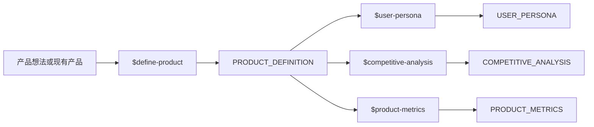
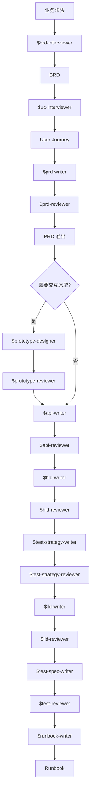
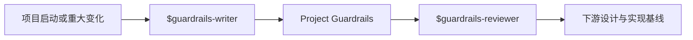

# gainfactor-pm

面向 Codex / ChatGPT 桌面端的产品研究与研发文档插件。它覆盖产品定义、用户研究、竞品分析、指标设计、需求与技术设计、测试交付，并提供统一的本地文档阅读与评审门户。

## 能力范围

gainfactor-pm 当前包含 25 个可调用 Skill：

- **流程导航**：`guide`
- **产品研究**：`define-product`、`user-persona`、`competitive-analysis`、`product-metrics`
- **需求与交互**：`brd-interviewer`、`uc-interviewer`、`prd-writer`、`prd-reviewer`、`prototype-designer`、`prototype-reviewer`
- **接口与设计**：`api-writer`、`api-reviewer`、`hld-writer`、`hld-reviewer`、`lld-writer`、`lld-reviewer`
- **测试与交付**：`test-strategy-writer`、`test-strategy-reviewer`、`test-spec-writer`、`test-reviewer`、`runbook-writer`
- **项目规范**：`guardrails-writer`、`guardrails-reviewer`
- **文档门户**：`document-publisher`

本插件不包含测试平台中的 case 注册、pipeline 编排、trigger 或 execution 管理能力。README 只描述当前插件实际提供的 Skill。

默认跟随用户输入语言输出；用户显式指定语言时以用户要求为准。`TRACEABILITY-METADATA` 的字段名、枚举值和稳定 ID 始终保持英文。

## 从哪里开始

不确定当前项目处于哪个阶段时，使用：

```text
$guide 扫描当前项目并推荐下一步
```

`guide` 会根据仓库中已经存在的文档、状态和准出结果，在本插件实际可用的 Skill 中推荐下一步。

## 工作流

### 产品研究

产品研究产物是可复用上下文，不强制要求每个项目全部执行。



- `define-product` 建立产品定位、角色、价值机制、责任边界、生命周期和商业模式基线。
- `user-persona` 基于具体行为和情境形成用户分群、强制 Persona、理想体验路径及用户反馈驱动的功能优先路径。
- `competitive-analysis` 研究市场与竞品，通过公开证据、产品体验和必要的 AI 黑盒测试形成产品决策。
- `product-metrics` 定义主要指标、驱动与过程指标、底线指标、计算口径及响应动作。

### 研发主链路



原型是前端项目中的可选验证阶段。API Contract、HLD、Test Strategy、LLD 和 Test Spec 分别由 Writer 生成，再由对应 Reviewer 作为独立门禁评审。

### 项目级 Guardrails

Guardrails 是项目级工程基线，不随每个功能重复创建。项目启动、重大架构或平台变化、合规要求、事故复盘以及重复评审问题需要固化时使用。



### 文档门户

文档门户是横跨所有文档类型的表达与阅读能力：


职责边界：

- **业务 Skill** 决定报告体裁、结构、结论、字段和表达选择，并直接写出最终内容。
- **`document-publisher`** 提供门户已注册能力、组件契约、选择规则、Markdown 降级，以及门户发现、创建、更新、评审挂载、构建、验证和预览流程；发布阶段不把普通 Markdown 二次理解成报告。

## Skill 选择表

| 目标 | 使用 |
|---|---|
| 扫描项目并判断下一步 | `$guide` |
| 定义产品定位、价值与责任边界 | `$define-product` |
| 建立用户分群、Persona 和用户驱动的功能路径 | `$user-persona` |
| 研究市场、竞品和产品差异 | `$competitive-analysis` |
| 定义主要指标、过程指标和底线指标 | `$product-metrics` |
| 把业务想法整理成 BRD | `$brd-interviewer` |
| 从 BRD 梳理用户旅程 | `$uc-interviewer` |
| 撰写或评审 PRD | `$prd-writer` / `$prd-reviewer` |
| 在前端仓库创建或评审交互原型 | `$prototype-designer` / `$prototype-reviewer` |
| 撰写或评审 API Contract | `$api-writer` / `$api-reviewer` |
| 撰写或评审 HLD | `$hld-writer` / `$hld-reviewer` |
| 撰写或评审测试策略 | `$test-strategy-writer` / `$test-strategy-reviewer` |
| 撰写或评审 LLD | `$lld-writer` / `$lld-reviewer` |
| 撰写测试规格或执行测试门禁评审 | `$test-spec-writer` / `$test-reviewer` |
| 编写部署、回滚、监控与故障处理手册 | `$runbook-writer` |
| 建立或评审项目级工程规范 | `$guardrails-writer` / `$guardrails-reviewer` |
| 设计门户内容，或将已完成文档导入、验证和预览 | `$document-publisher` |

## 产品研究产物

### PRODUCT_DEFINITION

`define-product` 适用于外部用户产品、现有产品新能力以及需要明确价值和权限边界的内部产品。它输出稳定的产品定义基线，供用户画像、竞品分析、产品指标和需求任务复用。

```text
$define-product 定义一个帮助独立开发者验证产品方向的服务
```

### USER_PERSONA

`user-persona` 可以综合用户已有材料，也可以使用相互隔离的虚拟用户 Agent 收集反馈。每个保留群体必须形成代表性 Persona；基于用户反馈推导的功能路径表达理想方向，不等同于正式研发排期。

报告中的人物图片属于 `PersonaBrief`，导入门户时由发布器搬运资源并解析首屏卡片映射，不重复插入 Markdown 图片或预测门户资产路径。

```text
$user-persona 基于 ./docs/gainfactor/example-product/product-definition.mdx 建立用户画像
```

### COMPETITIVE_ANALYSIS

`competitive-analysis` 要求先明确主产品和竞品范围，区分公开事实、体验观察、合理推测和待验证项。没有实际访问或测试证据时，不填写虚构评分和产品能力。

```text
$competitive-analysis 基于 ./docs/gainfactor/example-product/product-definition.mdx 分析主要竞品
```

### PRODUCT_METRICS

`product-metrics` 根据指标任务选择产品级北极星指标或任务级主要指标，建立驱动树、计算契约、底线指标和行动责任。没有事实依据时保留待建立基线或待验证阈值，不编造数字。

```text
$product-metrics 基于 ./docs/gainfactor/example-product/product-definition.mdx 设计指标体系
```

## 文档门户能力

### 产物目录

产品型正式文档使用稳定目录与文件名：

```text
docs/gainfactor/{product-slug}/
├── product-definition.mdx
├── user-persona.mdx
├── competitive-analysis.mdx
├── product-metrics.mdx
├── assets/{artifact-key}/
└── .work/

.gainfactor/portal/        # 可从正式源文件重建的统一本地门户
```

文件名不包含日期；版本、状态和更新时间进入文档元信息与 portal manifest。`.portal.json`、`.review.json` 与正文同名，生成门户和研究 sidecar 默认不作为正式内容源。

### 内容表达

`document-publisher` 当前注册的主要能力包括：

- 标准 Markdown：标题、段落、列表、引用、表格、链接和代码；
- Mermaid：流程、时序、状态、依赖和节点关系；
- 本地 AntV Infographic：锁定 npm 版本，不请求 CDN，并内置官方模板选择与语法生成规范；
- Lucide 图标：完整图标集合，不设业务白名单；
- Fumadocs / MDX：Callout、Tabs、Steps、Files、TypeTable、ImageZoom；
- 门户图形：Mermaid 与 AntV Infographic；
- 通用报告组件：`PersonaBrief`、`FieldList`、`Panel`、`Board`、`EvidenceStep`；非人物场景使用 `Panel + FieldList`，线性步骤使用 Fumadocs `Steps/Step`；
- Portal Presentation v1：`metrics`、`cards`、`steps`、`callout`。

通用报告组件只负责呈现，不内置优先级、路线图、阶段或特定文档类型语义。所有富组件都需要标准 Markdown 降级方案，并兼顾桌面端、移动端、深浅色和打印布局。

### 图片映射

Portal Presentation 的卡片可以用 `sourceImageAlt` 引用正文图片。发布器可解析：

```md

```

以及：

```mdx
<PersonaBrief name="林岚" image={{ src: "...", alt: "..." }} />
```

相同 alt 指向相同 src 时合并；相同 alt 指向不同 src 时校验失败，不按出现顺序猜测。

### 本地启动

`document-publisher` 每次创建或更新门户时，会在门户根目录生成：

- `打开文档门户.command`
- `关闭文档门户.command`

macOS 用户可以双击启动或关闭。首次打开或内容变化时自动准备构建，后续复用已有构建与服务，无需让 AI 执行启动命令。业务 Skill 已明确要求自动导入时，不再额外询问一次是否生成门户文档。

## 追溯能力

PRD、HLD、LLD、Test Strategy 和 Test Spec 支持统一的 `TRACEABILITY-METADATA`。当前 RTM 可以聚合：

```text
REQ-* → DEC-*/FLOW-* → DEC-*/FLOW-* → RISK-*/MR-*/BEH-* → CASE-*
```

主要契约位于 `references/traceability-schema/`。从仓库根目录运行：

```bash
python3 plugins/gainfactor-pm/scripts/trace_lint.py <文档或 metadata.yaml>
python3 plugins/gainfactor-pm/scripts/trace_lint.py --strict <文档或 metadata.yaml>
python3 plugins/gainfactor-pm/scripts/trace_build_rtm.py --format json <多个 metadata 文档>
```

## 安装与更新

仓库包含本地 Marketplace：

```text
.agents/plugins/marketplace.json
plugins/gainfactor-pm/
```

在仓库根目录首次安装：

```bash
codex plugin marketplace add .
codex plugin add gainfactor-pm@gainfactor-plugins
```

插件更新后重新安装：

```bash
codex plugin add gainfactor-pm@gainfactor-plugins
```

检查安装状态：

```bash
codex plugin list
```

安装或更新后，请新建 Codex 任务，使新的 Skill 和插件资源生效。

## 开发验证

插件结构校验：

```bash
python3 /Users/dylan/.codex/skills/.system/plugin-creator/scripts/validate_plugin.py plugins/gainfactor-pm
```

文档编译与门户导入测试：

```bash
python3 -m unittest \
  plugins/gainfactor-pm/scripts/tests/test_compile_portal_document.py \
  plugins/gainfactor-pm/scripts/tests/test_create_document_portal.py
```

门户构建：

```bash
pnpm --dir plugins/gainfactor-pm/assets/document-review-portal run build
```

更新本地插件缓存版本：

```bash
python3 /Users/dylan/.codex/skills/.system/plugin-creator/scripts/update_plugin_cachebuster.py \
  plugins/gainfactor-pm
codex plugin add gainfactor-pm@gainfactor-plugins
```

## 目录

```text
plugins/gainfactor-pm/
├── .codex-plugin/plugin.json
├── assets/document-review-portal/   # 本地文档门户模板
├── references/                      # 跨 Skill 契约与追溯规范
├── scripts/                         # 导入、编译和追溯工具
└── skills/                          # 26 个可调用 Skill
```
