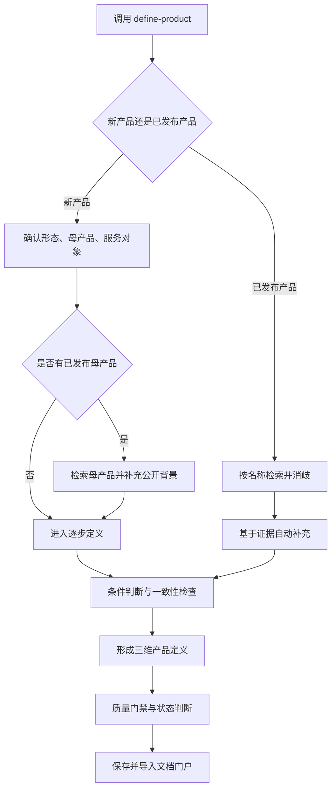

# Define Product：产品定义方法与 Skill 结构

这份 README 说明两件事：

1. 我如何定义一个产品，以及每一步为什么存在；
2. `define-product` Skill 如何把这套方法组织成可执行、可维护的流程。

产品定义最终回答三个问题：**给谁用、解决什么问题、为什么是这个产品**。它为用户画像、竞品分析、市场研究和需求工作提供事实基线，不展开详细功能、交互、技术方案、完整指标体系或项目排期。

## 一、我的产品定义方法

### 步骤 1：先区分新产品与已发布产品

- **新产品**：尚未投入使用，或只是准备加入现有产品的新能力。通过逐步澄清帮助定义者做出选择。
- **已发布产品**：已经投入使用，可能是自己的产品，也可能是需要分析的产品。根据名称检索、确认对象，再用证据还原其产品定义。

**为什么先分流**：两类产品的信息来源不同。新产品的关键事实尚未形成，不能由检索替用户决定；已发布产品已有大量公开事实，不应让用户重复介绍。先分流可以避免把推测当事实，也避免把研究任务变成低效访谈。

状态不明确时，只确认一次：这是尚未发布的新产品，还是已经投入使用的产品？

### 步骤 2：建立产品的基础坐标

新产品先确认三个入口信息；已发布产品通过检索自动补充：

| 维度 | 要确认的内容 |
|---|---|
| 产品形态 | App、网站、桌面端应用或其他 |
| 母产品关系 | 独立产品、母产品中的新能力、品牌下的独立子产品 |
| 服务对象 | 普通用户、企业或组织、个人与企业、本组织内部 |

随后根据主要价值机制判断产品类型，如社交、内容、娱乐、交易、效率工具或企业服务。产品形态、服务对象、产品类型和母产品关系是四个独立维度，不能混写。

**为什么先建立坐标**：同一个问题在不同载体、服务对象和母产品关系下，权限、场景、启动方式与价值边界都会不同。先确定坐标，可以防止后续讨论建立在不同的产品假设上。

如果存在已发布母产品，先检索其定位、用户、现有能力和可复用资产。公开资料可以证明资产存在，但不能证明新产品拥有数据权限或内部调用权；这些内部依赖仍需用户确认。

### 步骤 3：定义用户与问题

需要明确：

- 谁是主要价值对象；
- 他在什么情境下完成什么任务；
- 当前如何完成；
- 原有路径在哪一步受阻；
- 阻塞造成什么可观察后果。

问题使用“**情境 → 任务 → 阻塞 → 后果**”表达。

**为什么先定义问题**：功能是解法，不能证明问题成立。如果先讨论功能，很容易把“缺少某个功能”误写成用户问题。只有问题链条清楚，才能判断产品机制是否真正创造价值。

### 步骤 4：定义核心机制与产品差异

需要说明：

- 产品介入原路径的哪一步；
- 改变了什么信息、动作或关系；
- 依靠什么关键资产或能力；
- 为什么原有做法或普通替代品不能同样完成；
- 去掉哪些能力后，核心价值将不再成立。

**为什么用机制而不是功能定义产品**：功能描述产品“有什么”，机制解释产品“为什么有效”。只有机制才能把用户问题、产品差异和结果连接成因果链，也能避免把产品定义写成功能清单。

### 步骤 5：验证角色、场景与边界

实际使用角色不在入口阶段一次补齐，而是在价值机制涉及多方时识别必要角色。对每个角色检查其投入、收益、依赖、权限和责任。

再用核心场景验证：

- 什么触发用户进入产品；
- 用户带着什么输入开始；
- 产品完成什么关键转换；
- 用户何时首次感受到价值；
- 什么结果代表任务有效完成；
- 失败时如何识别、降级或退出。

**为什么需要这一步**：抽象定位可能在文字上成立，却无法在真实关系和场景中运行。角色检查用于发现供给、权限和责任冲突；场景检查用于证明产品确实能把问题转化为结果。

### 步骤 6：判断启动、采用与价值循环

外部产品需要解释第一批用户和供给从哪里来、首次价值如何出现，以及用户为什么继续使用。

内部效率产品采用另一套逻辑：

- 组织触达替代市场获客；
- 试点和首次采用替代外部冷启动；
- 持续使用和跨团队推广替代外部增长；
- 效率改善、数据沉淀和流程优化构成价值回流。

**为什么要讨论启动和循环**：产品价值在单次场景中成立，不代表产品能够被启动或持续存在。启动说明价值如何第一次发生，循环说明一次使用如何改善下一次结果。

### 步骤 7：补充条件判断

#### AI 价值判断

只要提到 AI、Agent、生成、推荐或自动决策，就判断：没有 AI 时任务如何完成、AI 介入哪一步、产生什么可观察改善、为什么普通自动化不足、成立条件是什么，以及错误如何降级。

结论分为：核心价值机制、关键增强能力、实现方式、价值待验证。只有前两类进入“为什么是这个产品”。

**为什么单独判断 AI**：AI 是实现技术，不天然等于用户价值。单独判断可以避免用技术标签代替产品差异。

#### 商业模式判断

非内部产品只记录实际采用的盈利方式，如广告、佣金、买卖差价、SaaS 订阅、一次性付费、按量付费、增值服务或沿用母产品模式。

SaaS 订阅是按周期购买基础软件使用权、席位或固定能力范围；增值服务是在基础产品之外，为额外功能、用量、专业服务、支持等级或权益单独付费。两者需要区分，但不是仅支持这两种模式。

内部效率产品跳过商业模式。

**为什么商业模式放在价值之后**：收费方式应建立在已经明确的受益者和付费价值上。过早讨论商业模式，容易让收入假设反过来替代用户价值。

### 步骤 8：一致性检查并形成三维定义

最后检查用户、问题、机制、角色、场景、启动、循环、商业和证据能否同时成立。高影响冲突必须解决；暂时无法确定的内容保留为待定义，不能静默补全。

最终总结为：

1. **给谁用**：主要价值对象是谁；
2. **解决什么问题**：在什么情境下，什么任务受到什么阻塞并造成什么后果；
3. **为什么是这个产品**：通过什么核心机制，利用什么关键资产、关系或责任边界，改变原有路径并产生目标结果。

**为什么最后只保留三个维度**：前面的分析负责保证定义成立，最后的三维表达负责让定义能够被理解和复用。它足够凝练，又保留了用户、问题和差异化之间的因果关系。

## 二、Define Product Skill 的结构

### 1. 总体运行逻辑



运行逻辑分为四段：

1. **路由**：判断新产品或已发布产品；
2. **定义或研究**：新产品逐步澄清，已发布产品基于证据还原；
3. **判断与门禁**：处理 AI、内部产品、商业模式和一致性；
4. **交付**：生成标准化 `PRODUCT_DEFINITION` 并导入文档门户。

### 2. 目录结构与职责

```text
define-product/
├── SKILL.md
├── README.md
├── agents/
│   └── openai.yaml
├── assets/
│   ├── gainfactor-pm-logo.png
│   └── gainfactor-pm-logo-small.png
└── references/
    ├── interview-flow.md
    ├── released-product-research.md
    ├── product-patterns.md
    └── artifact-schema-and-quality.md
```

| 文件 | 运行职责 |
|---|---|
| `agents/openai.yaml` | 提供展示名称、描述和默认提示 |
| `SKILL.md` | 定义适用边界、主路由、共享规则和交付方式 |
| `interview-flow.md` | 定义产品状态判断、新产品入口和逐步访谈 |
| `released-product-research.md` | 定义已发布产品与母产品的检索、消歧和证据规则 |
| `product-patterns.md` | 提供产品类型、关系、AI、启动和商业模式判断框架 |
| `artifact-schema-and-quality.md` | 规定文档结构、状态、导入格式和质量门禁 |
| `README.md` | 解释产品定义方法和 Skill 设计，不参与运行 |

### 3. Skill 的加载方式

Skill 使用渐进加载，避免一次读取全部规则：

1. **名称与 description**：Codex 先判断用户请求是否应该触发 `define-product`；
2. **SKILL.md**：加载所有路径共享的总路由和约束；
3. **references**：根据当前产品状态和条件，只加载会影响当前决策的文件。

| 当前情况 | 需要读取的规则 |
|---|---|
| 判断产品状态或定义新产品 | `interview-flow.md` |
| 研究已发布产品 | `released-product-research.md` |
| 新产品存在已发布母产品 | `released-product-research.md` 的母产品规则 |
| 涉及 AI、产品关系、启动或商业模式 | `product-patterns.md` |
| 生成或更新最终文档 | `artifact-schema-and-quality.md` |

入口文件负责路由，reference 负责具体执行，输出规范负责最终契约。同一条规则不应复制到多个文件。

### 4. 两条主流程如何执行

#### 新产品路径

先完成三个入口确认；有母产品时先自动研究母产品；随后逐步完成用户与问题、核心机制、角色关系、核心场景、启动循环和一致性确认。

每轮最多询问两个相互关联的问题。只有答案会改变产品定义时才追问；未知信息可以标记为待定义，不为填满模板强迫用户选择。

#### 已发布产品路径

收到名称后直接检索，不要求用户先介绍。先确认官方对象、版本和地区，再自动补充定位、用户、问题、机制、场景、边界、采用循环和商业模式。

事实分为已证实、产品方主张、合理推断、未知和冲突。能够继续检索解决的问题不询问用户；最后最多集中确认三个会改变核心定义的存疑项。

### 5. 信息状态与质量门禁

运行中持续维护五类信息：

| 状态 | 作用 |
|---|---|
| 已确认 | 作为当前事实基线 |
| 明确排除 | 防止后续重新引入已排除范围 |
| 当前理解 | 暂时成立、等待确认的解释 |
| 待定义 | 信息不足或只有工作假设 |
| 待确认冲突 | 两个不能同时成立的定义或证据 |

新产品只有通过质量门禁并由用户确认后才是 `confirmed`。已发布产品需要对象明确、核心字段有可靠证据且关键冲突已解决。其他情况仍可交付，但状态为 `draft`，并说明缺口及影响。

### 6. 输出与交付

完整产物使用标准 Markdown，保持稳定结构，能够直接导入 GainFactor 文档门户。默认流程为：

1. 保存 `docs/Product-Definition-{产品名}-{YYYYMMDD}.md`；
2. 使用 `document-review` 导入“产品文档”集合；
3. 校验源 Markdown、门户 MDX 和门户清单一致；
4. 返回三维定义摘要、文件位置、门户目录和路由。

自动导入不等于自动启动本地服务。只有用户要求预览、打开或启动时才启动门户。

### 7. 修改与验证

按规则职责选择修改位置：

- 改触发、边界或总路由：`SKILL.md`；
- 改新产品访谈：`references/interview-flow.md`；
- 改已发布产品研究：`references/released-product-research.md`；
- 改 AI、类型、启动或商业判断：`references/product-patterns.md`；
- 改输出结构或门禁：`references/artifact-schema-and-quality.md`；
- 改界面展示：`agents/openai.yaml`。

修改后运行：

```bash
python3 /Users/dylan/.codex/skills/.system/skill-creator/scripts/quick_validate.py \
  plugins/gainfactor-pm/skills/define-product

python3 /Users/dylan/.codex/skills/.system/plugin-creator/scripts/validate_plugin.py \
  plugins/gainfactor-pm

python3 plugins/gainfactor-pm/scripts/validate_codex_compat.py
```

行为测试应在新任务中执行，避免旧任务继续使用之前加载的 Skill 指令。
