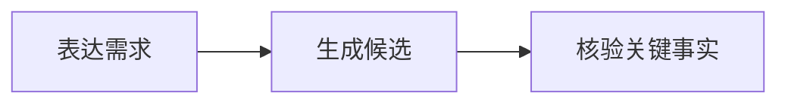

# 工具目录与写法

以下名称均已在门户 MDX 上下文注册。`.md` 使用标准 Markdown 和 fenced Mermaid；使用 JSX 组件时源文件必须是 `.mdx`。

## 选择表

| 关系 | 工具 | 来源 |
|-|-|-|
| 普通叙述、精确表格、列表、引用 | Markdown | 标准 |
| 代码示例 | fenced code；复杂容器用 `CodeBlock` / `Pre` | Fumadocs |
| 同构入口或相关对象 | `Cards` / `Card` | Fumadocs |
| 结论、风险、限制 | `Callout` | Fumadocs |
| 互斥视图 | `Tabs` / `Tab` | Fumadocs |
| 线性操作或阶段 | `Steps` / `Step` | Fumadocs |
| 文件目录 | `Files` / `Folder` / `File` | Fumadocs |
| 类型或接口字段 | `TypeTable` | Fumadocs |
| 需放大查看的图片 | `ImageZoom` | Fumadocs |
| 标题、状态、步骤或关键概念的图标补充 | `Icon` | Lucide，本地完整图标集合 |
| 图片、主体摘要、字段、标签和详细正文 | `Profile` | GainFactor 门户 |
| 紧凑的多字段概览 | `InfoGrid` | GainFactor 门户 |
| 带结构化字段的连续步骤 | `StructuredSteps` | GainFactor 门户 |
| 可重复的标题、字段、正文和提示单元 | `ContentPanel` | GainFactor 门户 |
| 多个分组及其同构条目 | `GroupedBoard` | GainFactor 门户 |
| 流程、时序、状态、依赖、复杂节点图 | fenced `mermaid` | Fumadocs 官方推荐集成 |
| 路线图、摘要、对比、层级和视觉叙事 | `Infographic` | AntV，本地 npm/SSR |
| 少量节点及其有向关系 | `NodeGraph` | GainFactor 门户 |

## 可复制语法

```mdx
<Callout type="warning" title="限制">这条结论存在前置条件。</Callout>

<Cards>
  <Card title="方案 A" description="适合低复杂度场景" href="#方案-a" />
  <Card title="方案 B" description="适合高控制需求" href="#方案-b" />
</Cards>

<Tabs items={['用户视角', '系统视角']}>
  <Tab>用户看到的变化。</Tab>
  <Tab>系统需要完成的处理。</Tab>
</Tabs>

<Steps>
  <Step>表达约束</Step>
  <Step>比较候选</Step>
</Steps>

<Files>
  <Folder name="src" defaultOpen>
    <File name="index.ts" />
  </Folder>
</Files>

<ImageZoom src="/document-assets/example.png" alt="关键界面" width={1200} height={800} />

<Icon name="target" label="目标" />
<Icon name="triangle-alert" label="风险" size={20} strokeWidth={1.8} />
```

`TypeTable` 和 `NodeGraph` 使用对象数据：

```mdx
<TypeTable type={{
  userId: { type: 'string', required: true, description: '用户标识' },
  status: { type: "'active' | 'disabled'", description: '当前状态' }
}} />

<NodeGraph
  nodes={[{ id: 'input', label: '输入' }, { id: 'result', label: '结果' }]}
  edges={[{ from: 'input', to: 'result', label: '生成' }]}
/>
```

Mermaid 使用 fenced block，不直接写 `<Mermaid>`：

````md

````

选择 AntV Infographic 时，读取本 Skill 内置的 `antv-infographic-syntax.md` 选择模板并生成 DSL，然后直接嵌入最终 `.mdx`：

```mdx
<Infographic
  caption="从需求表达到结果核验"
  syntax={`infographic sequence-ascending-steps
data
  title 理想体验路径
  sequences
    - label 表达约束
      icon edit
    - label 获得候选
      icon cards
    - label 核验结果
      icon shield check`}
/>
```

门户锁定本地 `@antv/infographic` 版本并由本地浏览器包输出 SVG，内置本地图标兜底并禁用远程字体。不要写 CDN、`unpkg`、`@latest` 或外部字体 URL。Infographic 用于视觉叙事；精确技术拓扑仍优先 Mermaid。

正文 `Icon` 与 AntV Infographic 的 `icon` 字段都接受门户锁定版本中存在的全部 Lucide 名称，不设业务白名单。查找渠道、命名规则、可访问性和具体写法见 [Lucide 图标渠道与写法](lucide-icons.md)。

`Profile`、`InfoGrid`、`StructuredSteps`、`ContentPanel` 与 `GroupedBoard` 的完整字段契约、选择边界和 Markdown 降级见 [通用报告组件](generic-report-components.md)。这些组件只提供布局，不内置 Persona、竞品、功能优先级、路线图或其他业务字段。

## 首屏工具

`.portal.json` 只允许 `metrics`、`cards`、`steps`、`callout`。它们与正文 MDX 组件同名时也属于不同协议，字段必须按 `capabilities.md` 的 Portal Presentation v1 编写。
