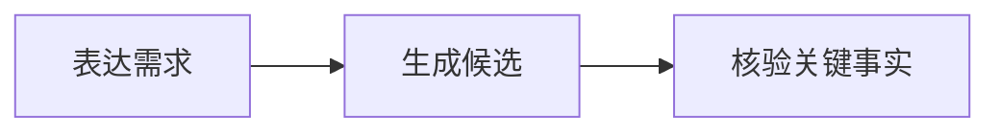

# Mermaid

流程、时序、状态、依赖、多种边语义和分支回路统一使用 fenced Mermaid；门户负责渲染、主题同步、尺寸恢复和错误降级。

````md

````

不要直接写 `<Mermaid>`，也不要用自定义节点数组恢复已经删除的关系图组件。只有摘要、阶段、对比、层级或视觉故事明显优于技术图时才转入 [`AntV Infographic`](../infographic/index.md)。精确数据继续使用表格。
